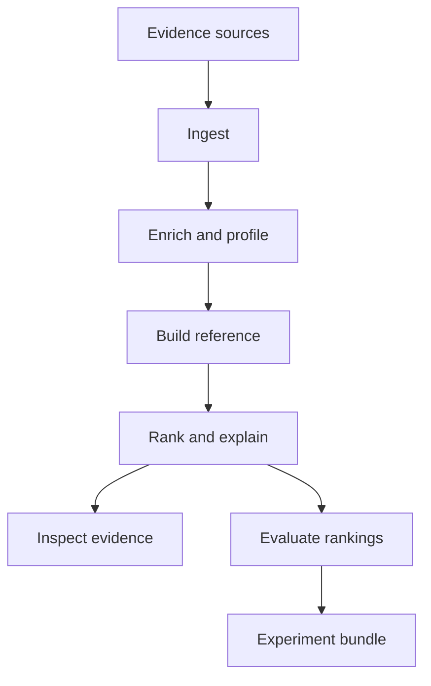
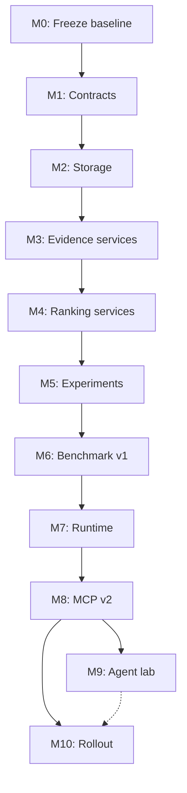

# JAWS Research Workbench Implementation Plan

| Plan field | Value |
| --- | --- |
| Status | Active |
| Last reviewed | 2026-08-20 |
| Integration branch | `codex/readme-research-workbench` |
| Starting documentation revision | `497f15a` |
| Starting code revision | `0b68a8c` (the two later commits change only `README.md`) |

## Purpose

This file is the execution anchor for turning JAWS into the research workbench defined in `README.md`.

The README describes what JAWS is. This file records how the implementation will reach that architecture, what must remain true along the way, how each milestone will be verified, and what evidence is required before a milestone can be called complete.

This is a research-program plan rather than a feature backlog. Its ordering protects experimental validity: current detector behavior is recorded before it is refactored; deterministic services exist before experiments depend on them; experiment provenance exists before benchmark claims are expanded; and an optional agent is introduced only after experiments and rewards can be evaluated without an agent.

## How to use this plan

1. Treat the milestone status table below as the source of truth for implementation progress.
2. Work on one primary milestone at a time. A later milestone may be explored, but it must not silently introduce a dependency into an earlier one.
3. Mark a task complete only when its implementation and verification evidence are both present.
4. Attach each completed milestone to its benchmark artifact, test run, architecture decision records, and migration notes.
5. Record intentional changes to detector behavior as experiment results. Do not disguise them as refactor parity.
6. If a completion gate changes, record why in an ADR and in this file's change log.
7. Keep `main` stable. Build the complete rollout on the integration branch, using short-lived milestone branches when useful, and merge the rollout only after Milestone 10 passes.
8. Preserve the current CLI entry points until the replacement adapters have parity tests and a documented migration path.
9. Keep implementation status in this file. Do not turn the README back into a current-versus-future roadmap.

## Milestone status

| Milestone | Outcome | Status | Depends on |
| --- | --- | --- | --- |
| 0 | Research contract and Benchmark 0 | Complete | — |
| 1 | Project foundation and typed contracts | Complete | 0 |
| 2 | Versioned evidence storage and migrations | Complete | 1 |
| 3 | Ingest, enrichment, and profiling services | In progress | 2 |
| 4 | Comparison, ranking, explanation, and inspection services | Not started | 3 |
| 5 | Experiment, run, provenance, and artifact system | Not started | 4 |
| 6 | Benchmark v1 and ranker research platform | Not started | 5 |
| 7 | Reproducible runtime and container profiles | Not started | 6 |
| 8 | MCP v2 research interface | Not started | 5, 7 |
| 9 | Optional agent laboratory | Not started | 6, 8 |
| 10 | Integrated rollout and release qualification | Not started | 0–8; 9 only if included in the release |

Milestone 9 is architecturally optional: the core research workbench can ship without an agent. If it is excluded from the first rollout, Milestone 10 must explicitly record that decision rather than leaving the status ambiguous.

## Delivery principles

The following are project constraints, not suggestions:

- JAWS serves security researchers, blue teams, and technically capable white/gray-hat researchers. It is not being optimized as a consumer or turnkey SOC product.
- JAWS ranks observations for investigation. It does not convert anomaly scores into autonomous malicious/benign verdicts.
- The experiment is the primary unit of reproducibility; packet evidence remains the authority behind every finding.
- Ranking quality is evaluated separately from software correctness.
- Rewards are deterministic metric vectors. An LLM may interpret them but does not calculate or replace them.
- The deterministic Python core does not depend on an agent framework, MCP, a CLI, or a particular database driver.
- CLI, MCP, benchmarks, notebooks, and agents invoke the same application services.
- Neo4j is the evidence and relationship store. Portable experiment bundles are the canonical record of specifications, results, metrics, and artifact checksums.
- Agent execution, analysis execution, and live packet-capture privileges remain separate.
- Raw captures and malware traffic are never committed merely to make a benchmark convenient. Dataset manifests record acquisition, labels, licenses, and checksums.
- IP address remains a supported entity type, but the architecture must not equate an IP permanently with a physical device or human identity.

## Current codebase assessment

This inventory is the baseline for the plan. It should be updated when a milestone materially changes the architecture.

### Current pipeline

| Operation | Current implementation | Primary coupling |
| --- | --- | --- |
| Capture/import | `jaws/jaws_capture.py` | PyShark, local host discovery, Neo4j writes, CLI rendering |
| Enrichment | `jaws/jaws_ipinfo.py` | IPinfo client, endpoint classification, repository writes |
| Profile/embed | `jaws/jaws_compute.py` | Repositories, pandas, feature aggregation, local/OpenAI embeddings, retention |
| Compare/rank/explain | `jaws/jaws_finder.py` | Repositories, feature engineering, historical reference logic, PCA/DBSCAN, scoring, explanations, plots, CLI |
| Inspect/orchestrate | `jaws_mcp/server.py` | FastMCP, CLI subprocesses, direct Cypher, duplicated interface documentation |
| Configuration/schema/admin | `jaws/config.py`, `jaws/jaws_utils.py` | environment loading, clients, output, schema creation, model download, destructive reset |
| Runtime | `harbor/Dockerfile`, `ocean/Dockerfile` | unpinned images, build-time secrets, source cloned from `main`, idle process |

### Quantitative inventory at detector subject `0b68a8c`

- `jaws/jaws_finder.py`: 1,352 lines.
- `jaws_mcp/server.py`: 636 lines.
- `jaws/jaws_compute.py`: 442 lines.
- Core Python and MCP modules: 3,389 lines total.
- Tests and harness: 837 lines total.
- Twenty-three `test_*` functions, including parametrized quality tests.
- Eight built-in synthetic scenarios.
- Three optional real-PCAP scenarios derived from one externally acquired and labeled sample.
- No committed GitHub Actions workflow, lint configuration, type-check job, lock/constraints file, or declared test dependency.
- `requirements.txt` is one unsegmented runtime dependency set; most versions are unpinned.

Milestone 0 subsequently added a declared development test dependency group, eight
Benchmark 0 schemas, canonical and noncanonical bundles, seven deterministic CLI
compatibility cases, and a source-derived graph inventory. The detector subject inventory
above remains fixed so the baseline is not silently redefined by its collectors.

### Strengths to preserve

- One behavioral profile per endpoint per capture session.
- Accumulating capture and profile history rather than destructive replacement.
- Separate peer-relative and own-history reference frames.
- Cadence features remain peer-relative so a persistent beacon cannot normalize itself.
- Population-wide volume changes cancel in the historical frame.
- First-seen status is represented independently from feature deviation.
- Endpoint-relative directions are translated into the capture host's perspective.
- The capture host has a separate host-outbound ranking surface.
- Non-conversational multicast/broadcast traffic is retained as evidence but excluded from behavioral ranking.
- Ranked results exist even when DBSCAN flags no noise points.
- Reasons expose raw values, units, direction, robust-z, reference frame, and host-relative meaning.
- `inspect_endpoint` joins a finding back to profile history, peers, and packet samples.
- CLI subprocess output already uses a structured `{ "ok": boolean, ... }` envelope.
- Correctness tests pin subtle historical-baseline invariants.
- The recall harness treats detector quality as an observable research result rather than an ordinary pass/fail unit test.

### Liabilities this plan addresses

- Domain logic is concentrated in CLI modules rather than callable services.
- `jaws_finder.py` combines representations, references, ranking, clustering, explanations, storage, plotting, and interaction.
- The MCP server shells out to CLIs and also owns significant query logic.
- Current CLI and MCP descriptions duplicate behavior and can drift.
- The graph schema is initialized opportunistically during capture and has no explicit version or migration history.
- Capture IDs have second-level resolution and use `MERGE`, so simultaneous starts can collapse into one session.
- Imported PCAP perspective is inferred from the machine doing the import rather than declared in dataset/capture metadata.
- Profile nodes do not record feature-set version, description-template version, embedding model revision, or software provenance.
- Current profile retention and raw-packet retention are controlled differently but not expressed as a general policy.
- General experiment specifications, control/treatment relationships, and append-only
  experiment runs do not yet exist; Benchmark 0 now has a deliberately narrow run record.
- The legacy recall command still prints only a human table. The Benchmark 0 collector
  now retains the canonical versioned machine-readable replacement for comparison.
- Benchmark 0 now names and guards its three current known failures; general regression
  budgets and held-out-data governance remain undefined.
- Heavy dependencies are installed together even for operations that do not need them.
- The development dependency group now installs pytest and JSON Schema validation, but
  runtime dependencies remain unpinned and unsplit across lightweight, CPU, and GPU use.
- Database, MCP, capture, and full-pipeline contracts have little automated coverage;
  Milestone 0 now pins representative CLI envelopes and the existing graph shape.
- Container builds accept credentials as build arguments, use unpinned bases, clone a moving branch, and keep the analyzer alive with `tail -f /dev/null`.
- Destructive database reset is exposed to agent-mode callers without the interactive confirmation used for humans.

## Research object model

The implementation must use explicit, versioned records for the concepts below. Names may be refined through an ADR, but their responsibilities must not be recombined into an opaque pipeline configuration.

| Object | Responsibility | Identity/provenance requirement |
| --- | --- | --- |
| `DatasetManifest` | Declares capture sources, acquisition, licensing, labels, splits, and checksums | Stable dataset ID plus manifest schema version and content digest |
| `CaptureRecord` | One live capture or imported evidence source | Collision-resistant capture ID, source digest, start/end, status, host perspective, tool versions |
| `ObservationWindow` | Declares the temporal and capture scope under study | Exact capture IDs, bounds, filters, timezone, and perspective |
| `EntityDefinition` | Declares what is being represented and ranked | Type and version, such as endpoint-IP, host-destination, flow, service, or subnet |
| `RepresentationSpec` | Declares feature families and transformations | Feature-set ID/version, missing-value policy, text-template version, embedding backend/model/revision |
| `ReferenceSpec` | Declares the comparison population | Peer, historical, hybrid, or researcher-defined strategy plus eligibility rules |
| `RankerSpec` | Declares how observations receive scores and ranks | Ranker ID/version, parameters, random seed, score direction, deterministic tie-break |
| `HypothesisSpec` | States a falsifiable claim and its planned test | Control, treatment, target scenarios, success metric, regression budget, required evidence |
| `ExperimentSpec` | Immutable declaration of a study | Canonical serialization and digest-derived experiment ID |
| `ExperimentRun` | One execution of an experiment specification | Run ID, experiment digest, code revision, environment, lifecycle state, timestamps |
| `RankedFinding` | One ranked entity and its explanation | Stable entity reference, rank, scores, flags, feature contributions, evidence pointers |
| `EvidencePointer` | Joins a finding to supporting data | Capture/window/entity identity plus query/filter or immutable artifact reference |
| `EvaluationResult` | Deterministic reward vector and per-scenario metrics | Evaluator/version, labels, metrics, uncertainty, cost, artifact digests |
| `ObservationReport` | Compares control, treatment, and prior runs | Rank movements, regressions, support/refutation status, unresolved interpretation |

### Experiment identity and reruns

An experiment specification and an experiment execution are different objects:

- `experiment_id` is derived from the canonical, secret-free `ExperimentSpec` content. Semantically identical specs have the same identity.
- `run_id` identifies one execution of that spec. Multiple runs can expose nondeterminism, platform variance, or stochastic sensitivity without pretending they were different hypotheses.
- Seeds, dataset versions, model revisions, and ranking parameters belong in the specification when they can change analytical output.
- Hardware, operating system, installed package versions, container digests, start/end times, and runtime measurements belong in the run environment record.
- A rerun never overwrites an earlier run. A superseding run points to what it supersedes and why.

### Canonical experiment bundle

The initial artifact store is a local filesystem implementation behind an `ArtifactStore` protocol. Other stores may be added later without changing experiment semantics.

```text
experiments/
  <experiment_id>/
    spec.json
    hypothesis.json
    <run_id>/
      run.json
      environment.json
      rankings.jsonl
      metrics.json
      observation.json
      logs/
      artifacts/
      checksums.sha256
```

Rules:

- JSON schemas are versioned and committed.
- Canonical JSON is used for identity; human formatting does not affect the digest.
- Ranking rows use deterministic ordering and a stable tie-break.
- Large tabular outputs may additionally use Parquet, but JSON/JSONL metadata remains sufficient to locate and verify them.
- Raw PCAPs are referenced by dataset/capture ID and checksum, not copied automatically into every experiment bundle.
- Environment variable names may be recorded; secret values must never be written.
- Model names are insufficient by themselves: record provider, exact revision/digest when available, dimensions, normalization, and text-template version.
- Every generated plot or report is derived from retained machine-readable data and included in the checksum manifest.

## Target architecture

### Operation flow



### Package boundaries

The exact file names may change, but dependencies must flow inward toward domain and application contracts.

```text
jaws/
  domain/              # immutable records, IDs, enums, validation rules
  services/            # ingest, enrich, profile, compare, rank, inspect, evaluate use cases
  representations/     # numeric, timing, text, embedding, feature registries
  references/          # peer, history, hybrid, custom reference strategies
  rankers/              # simple baselines and research rankers
  explanations/        # contributions, reason codes, perspective translation
  evaluation/          # metrics, dataset/scenario runners, comparison reports
  storage/              # repository protocols and Neo4j implementations/migrations
  artifacts/            # experiment bundle schemas and stores
  adapters/
    cli/                # argparse/Typer/Rich adapter; no analytical logic
    providers/          # PyShark/tshark, IPinfo, OpenAI, sentence-transformers
jaws_mcp/               # thin MCP adapter over services
jaws_lab/               # optional agent laboratory; never imported by jaws core
benchmarks/             # manifests, scenario definitions, policies, baseline results
docs/adr/               # architecture decision records
tests/
  unit/
  contract/
  integration/
  benchmark/
  e2e/
```

### Layering rules

- `jaws.domain` imports no database driver, model SDK, CLI library, plotting library, or MCP package.
- Services depend on domain models and protocols, not concrete Neo4j or provider clients.
- Storage and provider adapters implement protocols defined inward of them.
- Rankers consume declared representations and references; they do not query Neo4j.
- Explanations consume scored contributions; they do not reverse-engineer a ranker's internal state after the fact.
- Evaluators consume rankings and labels; they do not special-case a particular ranker.
- CLI and MCP validate external input, call a service, and serialize the returned domain result.
- Plotting and report rendering consume retained result artifacts and cannot change scores.
- Importing lightweight domain or experiment modules must not import Torch, sentence-transformers, Neo4j, matplotlib, or MCP.
- Tests can replace storage, embedding, enrichment, clock, and ID generation with deterministic fakes.

## Compatibility ledger

These are current behaviors that must either survive refactoring or be changed intentionally through a recorded experiment/ADR.

| Behavior | Required verification |
| --- | --- |
| Packet timestamps come from capture evidence, not import processing time | Unit fixture plus PCAP import integration test |
| Timing intervals never cross capture-session gaps | Existing invariant retained and a multi-session contract test added |
| Timing uses the more regular qualifying direction rather than interleaved request/response traffic | Unit scenarios for one-way and bidirectional cadence |
| Sparse timing remains undefined/neutral below the declared packet gate | Boundary tests around `MIN_TIMING_PACKETS` |
| Endpoint profiles are unique per entity, representation version, and observation scope | Storage constraint and repository contract test |
| `latest`, explicit session, pooled `all`, and legacy scope semantics remain distinguishable | Service and migration tests |
| A pooled scope cannot use or become a historical baseline | Reference-strategy unit test |
| Historical comparison requires the configured minimum prior sessions | Boundary test |
| Peer-relative and own-history residuals are scaled in separate frames | Existing baseline regression test |
| Population-wide capture-duration shifts do not flag every endpoint | Existing and benchmark scenario tests |
| Cadence remains excluded from own-history normalization | Existing invariant test |
| First-seen is `null` with no history, `true` for a novel entity, and `false` for a returning entity | Existing test plus serialized contract snapshot |
| Low deviations are weighted/capped, with low `interval_cv` treated as signal and `interval_mean` saturated | Ranker unit tests and Benchmark 0 comparison |
| Full rankings exist independently of DBSCAN's outlier labels | Ranker contract test |
| Endpoint direction and host direction cannot be confused | Explanation snapshots for local and remote entities |
| Host-outbound ranking remains a first-class perspective | Dedicated representation/ranker scenario set |
| Non-conversational addresses remain inspectable but are excluded from conversational ranking | Classification and end-to-end test |
| Hosting/CDN organization labels are presented as infrastructure hints, not reputation verdicts | Explanation contract test |
| Every finding can be traced to profile, peers, history, and packet evidence | Inspection service integration test |
| Machine-facing success/failure responses have one typed envelope | CLI and MCP contract tests |
| An outlier verdict is distinct from a continuous ranking score | Domain schema and serialization tests |

## Milestone dependency graph



## Milestone 0 — Research contract and Benchmark 0

### Outcome

Create an immutable record of what the existing code does before structural changes begin. Benchmark 0 is a measurement, not a claim that the current detector is correct.

### Scope

#### Research contract

- [x] Confirm the README statement, research question, intended users, and non-goals as the project charter ([ADR-0001](docs/adr/0001-network-anomaly-ranking-research-workbench.md)).
- [x] Confirm the four analytical axes: representation, reference, ranking, and evaluation ([ADR-0002](docs/adr/0002-analytical-axes-and-research-operations.md)).
- [x] Confirm the seven operations: ingest, enrich, profile, compare, rank, inspect, and evaluate ([ADR-0002](docs/adr/0002-analytical-axes-and-research-operations.md)).
- [x] Adopt terminology for dataset, capture, observation window, entity, hypothesis, experiment, run, finding, evidence pointer, metric, and observation ([ADR-0003](docs/adr/0003-shared-research-terminology.md)).
- [x] Add an ADR template with sections for context, decision, alternatives, consequences, benchmark impact, migration, and reversal conditions ([template](docs/adr/template.md)).
- [x] Record the seven initial fixed research/architecture ADRs ([ADR index](docs/adr/README.md)); retain milestone-specific choices in the decision queue until they are due.

#### Reproducible development entry point

- [x] Declare development/test dependencies, including pytest, without changing analytical runtime behavior.
- [x] Add one documented command that creates a supported Python 3.12 development environment.
- [x] Record actual package versions used for Benchmark 0 in the canonical environment artifact.
- [x] Add a test collection command and separate correctness, Neo4j, synthetic-quality, and real-PCAP-quality invocations.
- [x] Verify a clean checkout can run the correctness tests without API credentials, a live capture interface, Neo4j, or a downloaded embedding model where those are not logically required.

#### Benchmark 0 measurement contract

- [x] Define Draft 2020-12 schemas for the bundle manifest, datasets, scenarios, run, environment, rankings, evaluation, and known failures.
- [x] Separate the detector subject revision from the collector revision and source digest.
- [x] Standardize one-based ranks, zero-based emitted positions, descending score order, null semantics, and explicit execution/quality status combinations.
- [x] Retain complete endpoint and host-outbound rankings with raw attributes, verdicts, full reason objects, and evidence pointers.
- [x] Represent numeric-only, text-only, and blended analytical modes with explicit `used`, `not_used`, `unavailable`, and `unsupported` states.
- [x] Add deterministic evaluation, generated-report, cross-record, secret-leak, and checksum validation.
- [x] Commit a clearly noncanonical contract fixture covering all eight synthetic scenarios, three known failures, and explicit skips for all documented unavailable PCAP scenarios.
- [x] Document collection, validation, regeneration, evidence, licensing, and secret-handling rules in [`benchmarks/README.md`](benchmarks/README.md).

#### Baseline capture

- [x] Tag the full code-under-test revision (`0b68a8c1ed615c96355989702126de623c78a714`) in the Benchmark 0 manifest.
- [x] Preserve the subject revision's 23 test functions and their parametrized cases as the starting correctness/quality inventory.
- [x] Run and record the default correctness suite: 42 cases passed and 10 quality/integration cases were deselected in the collector environment.
- [x] Run each synthetic scenario with declared seeds and retain every ranking, not only pass/fail.
- [x] Record expected known quality failures rather than weakening assertions until they pass.
- [x] Evaluate optional real-PCAP availability and run scenarios when their externally acquired sample is present.
- [x] Record absence of optional datasets as an explicit skip with reason, never as a pass.
- [x] Capture both endpoint and host-outbound ranking surfaces.
- [x] Capture numeric-only output and explicitly record text-only and blended modes as unavailable for this harness.
- [x] Record current CLI JSON envelopes for capture-listing, compute, rank, and failure paths using deterministic fixtures/fakes ([CLI contract](benchmarks/baseline-0/compatibility/cli-contract.json)).
- [x] Record current Neo4j labels, relationships, properties, indexes, and constraints across every Cypher-bearing source location ([graph inventory](benchmarks/baseline-0/compatibility/neo4j-schema.json)).
- [x] Record the resolved package inventory and current container-definition digests and base images.
- [x] Store stdout, stderr, exit status, timing, environment, seed, scenario, rank, score, reasons, DBSCAN label, and parameters as machine-readable data.

#### Benchmark 0 artifact

- [x] Create `benchmarks/baseline-0/manifest.json` with schema version, code revision, dataset digests, scenario versions, commands, and environment reference.
- [x] Create `benchmarks/baseline-0/rankings.jsonl` with complete per-scenario ranked outputs.
- [x] Create `benchmarks/baseline-0/environment.json` with Python, packages, OS, CPU/GPU, tshark, Neo4j, embedding model, and container versions when applicable.
- [x] Create a concise Markdown report generated from the machine-readable results.
- [x] Checksum every baseline artifact.
- [x] Document how to regenerate the baseline without committing restricted PCAPs or secrets.

### Completion gate

- A fresh supported environment can collect and run the declared test tiers.
- Benchmark 0 artifacts identify exact code, configuration, data, models, environment, and commands.
- Every built-in scenario has a retained full ranking and an explicit outcome.
- Known failures are visible and explained; the gate does **not** require the detector to pass every quality scenario.
- No detector, feature, score, threshold, or rank behavior changes are included in this milestone.

### Deliverables

- Research terminology/ADR records.
- Development/test dependency declaration.
- Benchmark 0 manifest, results, environment record, generated report, and checksum file.
- Current graph schema inventory.

### Completion evidence

- The canonical bundle identifies detector subject
  `0b68a8c1ed615c96355989702126de623c78a714`, ranking collector
  `7cc27297a68512fcae825a1182ca06dd2ff0d892`, and compatibility collector
  `8679f23c4b536f61961000b8f60406fd9ac3f5c2`.
- All eight controlled scenarios retain complete rankings. Five detection scenarios meet
  Recall@3; the three benign counterexamples remain named known failures rather than
  being relabeled as passes.
- All three documented real-PCAP scenarios are explicit `dataset_unavailable` skips.
- Seven CLI cases retain exact stdout, stderr, exit status, and parsed envelopes for
  capture listing, compute, endpoint/host-outbound ranking, handled failures, and
  argument validation.
- The graph inventory derives six labels, 40 node properties, five relationship types,
  three uniqueness constraints, and five indexes from 44 Cypher source locations.
- The compatibility files are manifest-declared, checksummed, secret-scanned, and
  reproducible from their clean collector revision.
- Detector, feature, scoring, threshold, label, and ordering source remains byte-identical
  to the Benchmark 0 subject.

## Milestone 1 — Project foundation and typed contracts

### Outcome

Introduce lightweight, versioned domain contracts and a maintainable project foundation without changing analytical behavior.

### Scope

#### Package and dependency design

- [x] Split dependencies into the smallest practical groups: core, Neo4j, capture, enrichment, OpenAI embeddings, local embeddings, plotting, MCP, agent lab, and development ([profiles](docs/dependencies.md)).
- [x] Pin direct dependencies through a reviewed constraints/lock strategy while preserving supported platform flexibility ([ADR-0008](docs/adr/0008-capability-extras-and-direct-constraints.md)).
- [x] Ensure a numeric-only benchmark does not install or import Torch/sentence-transformers.
- [x] Ensure an OpenAI-only installation does not require CUDA/local-model packages.
- [x] Keep Python 3.12 as the declared baseline and document the policy for adding later versions.
- [x] Add package metadata for research/security audiences and the unified project description.

#### Quality automation

- [x] Add formatting/lint rules and run them in CI ([policy](docs/quality.md)).
- [x] Add static type checking with an explicit initial coverage boundary and ratchet policy.
- [x] Add correctness-test CI for every change ([workflow](.github/workflows/ci.yml)).
- [x] Add optional/integration jobs for Neo4j and external tooling ([workflow](.github/workflows/integration.yml)).
- [x] Add benchmark smoke reporting without treating every metric change as an automatic failure.
- [x] Cache dependencies/models only where the cache key includes the relevant lock and model revision.

#### Domain contracts

- [x] Implement versioned types for IDs, capture state, observation windows, entity definitions, representations, references, rankers, findings, evidence pointers, and result envelopes ([ADR-0009](docs/adr/0009-standard-library-domain-contracts.md)).
- [x] Make experiment-facing specifications immutable after validation.
- [x] Define canonical UTC timestamp serialization and duration units.
- [x] Define consistent byte, packet, interval, ratio, rank, and score types/units.
- [x] Define a stable error taxonomy: validation, configuration, unavailable dependency, storage, provider, capture, experiment, and internal errors.
- [x] Define typed success/failure envelopes used by both CLI and MCP serializers ([ADR-0010](docs/adr/0010-versioned-service-and-legacy-result-envelopes.md)).
- [x] Define deterministic clocks and ID generators as injectable protocols.
- [x] Define stable ordering and tie-breaking rules for every ranking.

#### Settings

- [x] Replace module-level mixed configuration with a validated settings object ([ADR-0011](docs/adr/0011-standard-library-settings-and-redacted-secrets.md)).
- [x] Separate existing database, provider, model, artifact-store, runtime, and interface settings; keep capture parameters as explicit per-run inputs.
- [x] Validate required credentials only when the corresponding provider is invoked.
- [x] Define safe settings serialization for later run provenance while redacting secret values.
- [x] Preserve environment-variable compatibility for existing installations during the rollout.

#### Initial service ports

- [x] Define protocols for evidence storage, artifact storage, packet sources, enrichment providers, embedding providers, rankers, reference builders, evaluators, clocks, and ID generation ([ports](jaws/ports/contracts.py)).
- [x] Add deterministic in-memory/fake implementations needed by unit tests ([fakes](jaws/ports/fakes.py)).
- [x] Document allowed import directions and enforce them with a lightweight architecture test ([policy](docs/architecture.md)).

### Completion gate

- Domain/spec modules import successfully without Neo4j, Torch, sentence-transformers, matplotlib, PyShark, IPinfo, OpenAI, or MCP installed.
- CI runs formatting/lint, type checks for the declared boundary, and correctness tests.
- Existing CLI behavior and Benchmark 0 rankings are unchanged.
- External integrations can be replaced by deterministic fakes in unit tests.
- Settings serialization proves secrets are redacted.

### Deliverables

- Domain and protocol packages.
- Dependency groups and reproducible development setup.
- CI and quality configuration.
- Settings and error/result contracts.
- Architecture import-boundary tests.

## Milestone 2 — Versioned evidence storage and migrations

### Outcome

Make Neo4j a versioned implementation of explicit repository contracts rather than an implicit schema distributed across command modules.

### Scope

#### Schema ownership

- [x] Move schema definitions out of `jaws_utils.initialize_schema` into a versioned migration package ([migration registry](jaws/storage/migrations/)).
- [x] Assign a schema version and store applied migration metadata ([ADR-0012](docs/adr/0012-ordered-neo4j-schema-migrations.md)).
- [x] Document current and target node, relationship, property, constraint, and index contracts ([schema contract](docs/storage/neo4j-schema.md)).
- [x] Add schema status, validate, migrate, and dry-run operations (`jaws-schema`).
- [x] Make migrations idempotent and transactional where Neo4j permits.
- [x] Back up/export metadata before destructive or irreversible migrations (`jaws-schema migrate --backup`; verified schema and live-evidence checksums).
- [x] Test upgrade from a graph created by the starting code revision.
- [x] Test a fresh empty database migration.
- [x] Define downgrade/rollback behavior per migration; explicitly mark non-reversible migrations.

#### Evidence identities and lifecycle

- [x] Replace second-resolution capture identity with a collision-resistant ID while retaining a human-readable timestamp ([ADR-0013](docs/adr/0013-capture-identity-lifecycle-and-observation-scope.md)).
- [x] Record capture/import states: registered, running/importing, complete, partial, failed, and cancelled.
- [x] Record source kind, source name, content checksum when available, start/end, packet count, capture host perspective, filter, and tool versions.
- [x] Represent observation scope explicitly instead of relying only on a `CAPTURE_ID` property convention.
- [x] Define uniqueness for endpoint profiles using entity, scope, representation version, and model/revision as applicable.
- [x] Preserve legacy `CAPTURE_ID` lookup through migration aliases or compatibility fields.

#### Repository implementations

- [x] Implement `CaptureRepository` for lifecycle and catalog operations ([repository contract](docs/storage/repositories.md)).
- [x] Implement `PacketRepository` for batched evidence writes and scoped reads ([repository contract](docs/storage/repositories.md)).
- [x] Implement `EnrichmentRepository` for metadata and annotations ([ADR-0014](docs/adr/0014-enrichment-provenance-and-versioned-profile-sets.md)).
- [x] Implement `ProfileRepository` for versioned profile sets and histories ([ADR-0014](docs/adr/0014-enrichment-provenance-and-versioned-profile-sets.md)).
- [x] Implement `InspectionRepository` for bounded profile overviews and endpoint drill-down ([repository contract](docs/storage/repositories.md)).
- [x] Implement `FindingRepository` only for optional graph indexing of results; portable run artifacts remain canonical ([repository contract](docs/storage/repositories.md); schema version 6).
- [x] Implement `ExperimentIndexRepository` for experiment/run IDs, status, digests, and artifact URIs without duplicating complete bundles into the graph ([repository contract](docs/storage/repositories.md); schema version 5).
- [x] Centralize Cypher in storage adapters; application services and interface adapters must not contain Cypher ([architecture boundary](docs/architecture.md); `Neo4jDatabaseRuntime`).
- [x] Add repository contract tests that run against both fakes and a pinned Neo4j test instance.

#### Retention, export, and administration

- [x] Define independent policies for raw packets, capture metadata, profiles/embeddings, experiment indexes, and external artifact bundles ([ADR-0015](docs/adr/0015-declared-retention-plan-before-apply.md)).
- [x] Make retention a declared policy with dry-run output, not an incidental post-compute side effect (`jaws-retention`; the legacy compute flag delegates to the same service during compatibility).
- [x] Add export/import procedures that preserve schema version, provenance, IDs, and checksums ([ADR-0016](docs/adr/0016-portable-evidence-bundles-and-empty-target-import.md); `jaws-evidence`).
- [x] Replace unguarded agent-mode database deletion with an explicit administrative operation requiring exact target and confirmation semantics ([ADR-0017](docs/adr/0017-guarded-administration-and-payload-free-audit.md); `jaws-admin`).
- [x] Record deletions/retention actions in an audit log without recording secrets or packet payloads unnecessarily ([ADR-0017](docs/adr/0017-guarded-administration-and-payload-free-audit.md)).

#### Legacy migration cases

- [x] Migrate or explicitly quarantine profiles with no session stamp.
- [x] Preserve pooled `all` scope semantics without treating it as a chronological session.
- [x] Preserve old endpoint history order even if an older capture is re-profiled later.
- [x] Remove or migrate legacy `Unknown` ownership relationships for non-public IPs.
- [x] Preserve tri-state outlier meaning: true, false, and never scored.

### Completion gate

- A fresh database and a copy of a starting-revision database both reach the target schema through tested migrations.
- Repository contract tests cover success, empty data, duplicate/idempotent writes, partial failures, and transaction rollback.
- No Cypher remains in CLI, MCP, ranker, representation, reference, explanation, or evaluation modules.
- Export followed by import preserves record counts, IDs, schema version, and sampled checksums.
- Destructive administration cannot run from a generic analysis call without explicit confirmation inputs.

### Deliverables

- Versioned migrations and schema documentation.
- Neo4j repository implementations and fakes.
- Migration/rollback tests and legacy fixtures.
- Retention, export/import, and administration services.

## Milestone 3 — Ingest, enrichment, and profiling services

### Outcome

Extract evidence acquisition and representation building into deterministic services callable identically from tests, CLI, MCP, benchmarks, and future agents.

### Scope

#### Ingest service

- [x] Split live capture and PCAP import into separate packet-source adapters sharing one ingest service (`LivePacketSource`; `PcapPacketSource`).
- [x] Make the local/capture-host identity explicit in `CaptureSpec`; do not infer imported-PCAP perspective solely from the importer machine ([ingest contract](docs/services/ingest.md)).
- [x] Support an explicit local IP/entity for imported captures and dataset manifests ([ingest contract](docs/services/ingest.md)).
- [x] Preserve original packet timestamps and capture-session boundaries (`PacketObservation`; `IngestService`).
- [x] Define handling for non-IP, IPv4, IPv6, VLAN/tunnel, TCP, UDP, ICMP, and malformed/partial packets ([ingest contract](docs/services/ingest.md); `PySharkPacketParser`).
- [x] Record capture/display filters and tshark/PyShark versions ([ingest contract](docs/services/ingest.md)).
- [x] Hash imported files and record size/path/source metadata without assuming paths are portable (`CaptureSourceMetadata`; schema version 7; [ingest contract](docs/services/ingest.md)).
- [x] Batch writes with bounded memory and clear partial-failure semantics (`IngestService`).
- [x] Finalize capture state in `finally` paths so interrupted work is distinguishable from a clean zero-packet capture (`IngestService`).
- [x] Add cancellation support that safely flushes or marks a partial batch (`CancellationSignal`; `IngestService`).
- [x] Keep live capture privileges inside the capture adapter/process boundary (`LivePacketSource`; [architecture policy](docs/architecture.md)).

#### Enrichment service

- [x] Define provider-neutral enrichment records for ASN, organization, hostname, location, and confidence/source (`EnrichmentObservation`; `EnrichmentRecord`; [enrichment contract](docs/services/enrichment.md)).
- [x] Keep public/private/non-conversational classification deterministic and provider-independent (`classify_ip_address`).
- [x] Add provider result caching with acquisition timestamp and provider/version metadata (`EnrichmentService`; `EnrichmentRepository`).
- [x] Distinguish not-applicable, not-found, transient failure, permanent failure, and successfully enriched (`EnrichmentStatus`; [enrichment contract](docs/services/enrichment.md)).
- [x] Support researcher annotations and ground-truth labels separately from third-party enrichment (`ResearcherAnnotation`; [ADR-0014](docs/adr/0014-enrichment-provenance-and-versioned-profile-sets.md)).
- [x] Avoid merging unrelated unknown values into one misleading organization identity (`IpinfoEnrichmentProvider`).
- [x] Add rate-limit/retry policy with deterministic test doubles (`EnrichmentAcquisitionPolicy`; `WaitStrategy`; [enrichment contract](docs/services/enrichment.md)).

#### Profile service

- [x] Extract packet-to-entity aggregation from `jaws_compute.build_endpoint_profiles` into a pure profiler (`EndpointProfiler`; [profiling contract](docs/services/profiling.md)).
- [x] Make entity definition and observation window inputs explicit (`EndpointProfilingResult`; `ProfilingWindowError`; [profiling contract](docs/services/profiling.md)).
- [x] Preserve inbound/outbound counts, peers, ports, protocols, and timing semantics from Benchmark 0 (`tests/test_profile_service.py`; report-only benchmark parity).
- [ ] Version numeric feature definitions, transformations, missing-value policy, and units.
- [ ] Version the endpoint text-description template separately from embedding models.
- [ ] Make timing direction and minimum-evidence requirements visible in representation metadata.
- [ ] Ensure profile generation is deterministic for identical evidence and spec.
- [ ] Support endpoint-IP and host-destination profiles as first-class entity definitions rather than unrelated code paths.

#### Embedding providers

- [ ] Define a common embedding-provider protocol for local and remote providers.
- [ ] Record provider, model, exact revision/digest when available, dimensions, normalization, batching, and device.
- [ ] Validate returned count, dimension, order, and finite values before replacing a profile scope.
- [ ] Retain the mapping from profile ID and input-text digest to embedding.
- [ ] Make remote API cost/token metadata available to experiment provenance.
- [ ] Permit numeric-only representations with no embedding provider installed.
- [ ] Test provider failures without leaving a half-replaced profile set.

#### CLI compatibility adapter

- [ ] Make `jaws-capture`, `jaws-ipinfo`, and `jaws-compute` thin adapters over the services.
- [ ] Preserve existing flags or emit specific deprecation guidance.
- [ ] Preserve structured agent-mode envelopes and human-readable Rich output.
- [ ] Remove analytical/storage logic from these entry-point modules.

### Completion gate

- Pure ingest/profile tests run without Neo4j using fixture packet streams.
- PCAP import preserves timestamps and declared host perspective.
- Starting-revision fixtures produce parity profiles within exact or documented numeric tolerances.
- Model/provider provenance is stored with every embedding-backed profile.
- Numeric-only profiling works without local-model dependencies.
- Existing capture, enrichment, and compute commands pass compatibility contract tests.

### Deliverables

- Ingest, enrichment, profile, and embedding services.
- Live-capture, PCAP, IPinfo, OpenAI, and local-transformer adapters.
- Versioned representation specifications.
- CLI compatibility adapters and profile parity artifacts.

## Milestone 4 — Comparison, ranking, explanation, and inspection services

### Outcome

Decompose `jaws_finder.py` and MCP read queries into independently testable research components while preserving Benchmark 0 behavior in a named legacy ranker.

### Scope

#### Reference strategies

- [ ] Define a `ReferenceBuilder` protocol that returns the comparison population and eligibility metadata.
- [ ] Implement peer-relative reference behavior.
- [ ] Implement own-history reference behavior with minimum-session rules.
- [ ] Implement the current hybrid per-feature behavior where cadence remains peer-relative.
- [ ] Preserve separate scaling frames for peer and historical residuals.
- [ ] Represent first-seen and insufficient-history states explicitly.
- [ ] Make pooled-scope exclusion an enforced rule rather than a comment convention.
- [ ] Add a researcher-defined reference strategy using declared capture/entity filters.

#### Representations and feature registry

- [ ] Extract base counts, derived ratios, timing, and missing-value behavior into versioned feature families.
- [ ] Expose feature name, unit, direction, transformation, required evidence, and interpretation metadata.
- [ ] Preserve host-relative flow mappings as typed metadata.
- [ ] Make scale floor, saturation, low-direction weights, caps, and reason threshold explicit ranker parameters/versioned defaults.
- [ ] Detect non-finite values and representation mismatches before ranking.

#### Ranker interface and current behavior

- [ ] Define a ranker contract that consumes entities, representations, a reference result, and a ranker spec.
- [ ] Return continuous scores, deterministic ranks, optional model labels, and structured contributions separately.
- [ ] Implement `legacy_2_0` behavior matching current robust scoring plus PCA/DBSCAN labeling.
- [ ] Separate DBSCAN clustering/labeling from the continuous behavioral ranking contract.
- [ ] Extract epsilon recommendation into a declared, testable strategy.
- [ ] Record PCA components, whitening, explained variance, feature weights, epsilon source, and cluster diagnostics.
- [ ] Require deterministic tie-breaking by stable entity identity.
- [ ] Make random seeds explicit for every stochastic ranker or transformation.

#### Explanation service

- [ ] Generate reason codes from retained score contributions rather than recomputing features independently.
- [ ] Preserve raw value, unit, direction, standardized deviation, comparison frame, baseline, and baseline depth.
- [ ] Preserve host-relative direction text for local and remote perspectives.
- [ ] Preserve cloud-hosted/provider caveats without treating infrastructure ownership as reputation.
- [ ] Define explanation schema versions and snapshots.
- [ ] Add explanation-fidelity hooks that can ablate a cited feature and measure the score/rank effect.

#### Host-outbound and inspection

- [ ] Represent host-destination as an entity/perspective usable by the same service pipeline.
- [ ] Port upload bytes, upload packets, download values, and upload/download ratio into declared features.
- [ ] Preserve exclusion of multicast/broadcast/unspecified peers from conversational ranking.
- [ ] Extract endpoint/profile/history/peer/packet retrieval from `jaws_mcp.server` into an inspection service.
- [ ] Scope inspection explicitly: latest profile vs a requested session, while retaining all-session totals/history when requested.
- [ ] Return evidence pointers from findings so inspection does not rely on an unscoped IP string alone.
- [ ] Preserve service-port vs ephemeral-port interpretation and document its heuristic limitations.

#### Visualization adapter

- [ ] Move port-size, k-distance, PCA/DBSCAN, and comparison rendering out of ranking code.
- [ ] Render only from retained result artifacts.
- [ ] Make headless execution the default behavior for services.
- [ ] Record plot input digest and renderer version in artifact metadata.

#### CLI compatibility adapter

- [ ] Reimplement `jaws-finder` as a thin service adapter.
- [ ] Preserve `--components`, `--whiten`, `--eps`, `--feature-weight`, `--include-local`, `--session`, `--no-baseline`, and `--ablate` compatibility until migration is documented.
- [ ] Preserve full ranking output even when zero DBSCAN outliers are labeled.
- [ ] Preserve result fields or provide an explicit versioned response migration.

### Completion gate

- `legacy_2_0` reproduces Benchmark 0 ranks, scores, reasons, and labels within declared tolerances.
- Every compatibility-ledger invariant has a direct unit, contract, or benchmark test.
- Rankers, references, explanations, and inspection services contain no Neo4j, CLI, MCP, or plotting logic.
- The same service call powers endpoint and host-destination research surfaces.
- Every finding contains an evidence pointer sufficient for scoped inspection.
- `jaws_finder.py` no longer owns domain/storage/plotting behavior; it is removed or reduced to a compatibility adapter.

### Deliverables

- Reference, representation, ranker, explanation, inspection, and rendering packages.
- Named `legacy_2_0` ranker.
- Compatibility tests and parity report against Benchmark 0.
- Thin finder CLI adapter.

## Milestone 5 — Experiment, run, provenance, and artifact system

### Outcome

Make a complete ranking study reproducible from an immutable specification and portable result bundle.

### Scope

#### Schemas and identity

- [ ] Implement versioned schemas for `HypothesisSpec`, `ExperimentSpec`, `ExperimentRun`, `RankedFinding`, `EvaluationResult`, and `ObservationReport`.
- [ ] Define canonical, secret-free serialization.
- [ ] Derive and verify experiment content digests.
- [ ] Generate unique run IDs without changing experiment identity.
- [ ] Validate that referenced datasets, captures, representations, rankers, and evaluators exist and are compatible before execution.
- [ ] Include an explicit experiment-schema version and component version for every pluggable strategy.

#### Run lifecycle

- [ ] Implement planned, queued, running, completed, failed, cancelled, and superseded states.
- [ ] Make state transitions atomic and auditable.
- [ ] Store failure category, message, completed stages, and resumability without leaking secrets.
- [ ] Add cooperative cancellation between expensive stages.
- [ ] Define retry semantics: a retry creates a new run and points to the failed run.
- [ ] Distinguish cached/reused artifacts from newly computed ones.

#### Provenance

- [ ] Record code commit, dirty-tree status, package version, schema versions, Python, OS, architecture, CPU/GPU, memory, container digests, and installed dependency set.
- [ ] Record dataset/capture digests and label-source versions.
- [ ] Record representation, reference, ranker, evaluator, renderer, model, prompt/template, and provider versions.
- [ ] Record seed and deterministic-library settings.
- [ ] Record runtime, peak memory, GPU memory, and external API usage/cost when available.
- [ ] Redact tokens, passwords, credential contents, and unrelated environment values.

#### Artifact store

- [ ] Implement the canonical local filesystem bundle layout.
- [ ] Write files atomically through a staging directory and finalize only after checksums succeed.
- [ ] Verify bundles on load and report missing/mismatched artifacts.
- [ ] Support read-only bundle inspection independent of Neo4j.
- [ ] Index experiment/run summaries and artifact URIs in Neo4j through the repository protocol.
- [ ] Add export/import for a bundle without raw PCAP redistribution.
- [ ] Define garbage-collection behavior that never deletes evidence or runs still referenced by a comparison/report.

#### OHEO services

- [ ] Implement Orient: list datasets, captures, labels, representations, rankers, prior experiments, and benchmark summaries.
- [ ] Implement Hypothesize: validate falsifiable claims, control/treatment, metrics, and regression budgets.
- [ ] Implement Experiment: execute a bounded control/treatment matrix through the deterministic services.
- [ ] Implement Observe: calculate metric deltas, rank movement, regressions, costs, and support/refutation status.
- [ ] Keep human interpretation separate from deterministic observation fields.
- [ ] Link follow-up hypotheses to the observation that motivated them.

#### Research CLI

- [ ] Add commands to validate a spec, run an experiment, show status, cancel a run, inspect a run, compare runs, verify a bundle, and list available components.
- [ ] Support JSON input/output as the stable automation interface.
- [ ] Provide human-readable summaries derived from the same domain results.
- [ ] Keep individual operation commands available for exploratory use outside a formal experiment.

### Completion gate

- An experiment bundle can be validated and inspected without a live database.
- Re-running the same spec against the same evidence and deterministic environment produces identical ranked ordering and analytical fields; runtime-only fields may differ.
- A control/treatment experiment produces a deterministic observation report with traceable metric deltas.
- Interrupted and failed runs remain inspectable and never masquerade as complete.
- Provenance contains all output-affecting configuration while automated secret-leak tests pass.
- Bundle checksum verification detects intentional corruption in a test fixture.

### Deliverables

- Experiment schemas, runner, lifecycle, provenance collector, artifact store, and verifier.
- Orient/Hypothesize/Experiment/Observe application services.
- Research CLI and sample specs.
- Replay, cancellation, corruption, and secret-redaction tests.

## Milestone 6 — Benchmark v1 and ranker research platform

### Outcome

Provide comparable, reproducible evidence about which representations, references, and rankers most successfully allocate investigator attention.

### Scope

#### Dataset and scenario governance

- [ ] Version dataset manifests independently from code.
- [ ] Record source URL/location, acquisition date, license/redistribution terms, checksum, capture host, time bounds, labels, label provenance, and known limitations.
- [ ] Separate development, validation, and held-out scenario sets.
- [ ] Prevent routine tuning reports from exposing held-out labels where practical.
- [ ] Preserve synthetic scenarios as controlled tests while labeling them as model-authored traffic.
- [ ] Expand benign counterexamples: updates, backups, streaming, DNS, NTP/keepalive, monitoring, CDN bursts, scans from approved tools, and infrastructure churn.
- [ ] Expand anomaly scenarios: periodic and jittered beaconing, burst/slow exfiltration, fan-out/scan changes, first-seen infrastructure, protocol/port shifts, and behavioral change against history.
- [ ] Add varied real captures from documented primary sources, subject to licensing and safe-handling review.
- [ ] Keep malware binaries out of scope; acquire only the traffic evidence and labels required for the study.

#### Baseline rankers

- [ ] Seeded random ranking as a floor.
- [ ] Total bytes and directional bytes sorts.
- [ ] First-seen ranking.
- [ ] Upload/download ratio ranking.
- [ ] Peer-relative robust deviation.
- [ ] Own-history change score.
- [ ] Numeric-only current score.
- [ ] Embedding-only PCA/DBSCAN behavior.
- [ ] Current blended `legacy_2_0` behavior.
- [ ] Isolation Forest over the same declared numeric representation.
- [ ] Require each ranker to document score direction, supported entity/reference types, deterministic behavior, and explanation capability.

#### Reward vector

- [ ] Recall@1, @3, @5, and @10 where labels permit.
- [ ] Mean reciprocal rank.
- [ ] nDCG@k for graded relevance.
- [ ] Benign burden: benign observations above the first relevant finding and in top-k.
- [ ] Rank percentile for each labeled target.
- [ ] Top-k overlap and rank correlation across seeds/windows.
- [ ] Sensitivity to parameter perturbations.
- [ ] False-positive movement by benign scenario family.
- [ ] Explanation fidelity via feature/reason ablation.
- [ ] Runtime, peak memory, GPU memory, external API calls/tokens, and estimated cost.
- [ ] Failure/abstention coverage, including unavailable representations and insufficient populations.
- [ ] Preserve components individually; any scalar objective must declare its weights and cannot replace the vector in retained artifacts.

#### Runner and comparisons

- [ ] Execute matrices across datasets, entity definitions, representations, references, rankers, parameters, seeds, and windows from an `ExperimentSpec`.
- [ ] Reuse compatible cached profiles/embeddings by content digest.
- [ ] Prevent cache reuse when template, feature, model, normalization, or source evidence changes.
- [ ] Produce per-scenario rankings before aggregates.
- [ ] Compare control/treatment with paired deltas and uncertainty where repeated samples permit.
- [ ] Generate JSON, Markdown, and optional HTML reports from the same retained metrics.
- [ ] Report missing/skipped/failed scenarios separately from successful runs.
- [ ] Link every aggregate number to the contributing scenario/run IDs.

#### Benchmark policy

- [ ] Declare expected failures separately from accepted regressions.
- [ ] Define regression budgets per scenario family and metric before evaluating a proposed change.
- [ ] Require simple baselines in every comparative report.
- [ ] Prohibit claims based only on aggregate recall when benign burden or scenario coverage worsens.
- [ ] Define the procedure for promoting a held-out set, retiring a compromised set, and adding a replacement.
- [ ] Define how many seeds/windows are required for each benchmark tier.
- [ ] Keep the fast correctness suite blocking, the smoke benchmark visible, and the full quality benchmark scheduled/manual until policy thresholds are stable.

#### Extensibility

- [ ] Add registries for representations, references, rankers, evaluators, and renderers.
- [ ] Validate plugin metadata and schema compatibility before a run.
- [ ] Provide a minimal example ranker and scenario extension.
- [ ] Ensure third-party rankers receive bounded typed data, not database credentials or unrestricted shell access.

### Completion gate

- Every included ranker runs through the same experiment/evaluation path.
- Every benchmark report includes simple baselines and the full reward vector.
- Full rankings, skips, failures, environment, and artifact checksums are retained.
- Repeated deterministic runs reproduce rankings; stochastic runs declare seeds and report stability.
- Held-out governance and dataset licensing/safety records are documented.
- `legacy_2_0` is compared honestly against simpler sorts; no complexity is justified solely by intuition.

### Deliverables

- Dataset/scenario manifests and governance policy.
- Baseline ranker suite and registries.
- Benchmark runner, reward metrics, comparison reports, and CI/scheduled profiles.
- Benchmark v1 reference artifact.

## Milestone 7 — Reproducible runtime and container profiles

### Outcome

Replace the legacy `harbor/` and `ocean/` images with versioned, testable runtime boundaries that preserve least privilege and experiment provenance.

### Scope

#### Images

- [ ] Build from the checked-out source context; never clone a moving branch inside an image.
- [ ] Pin base-image versions/digests and record them in provenance.
- [ ] Use multi-stage builds and dependency groups for database tools, CPU analysis, GPU analysis, sensor, and MCP roles.
- [ ] Pass credentials at runtime through supported secrets/environment mechanisms, never build arguments or image layers.
- [ ] Run as non-root wherever capture requirements do not prevent it.
- [ ] Use explicit entry points that perform useful work or serve a health-checked process; remove `tail -f /dev/null`.
- [ ] Add OCI labels for source revision, package version, and build date.
- [ ] Generate dependency/image inventories suitable for auditing.

#### Compose profiles

- [ ] `compose.dev.yml`: pinned Neo4j, CPU analyzer, artifact volume, and MCP service.
- [ ] `compose.gpu.yml`: dev profile plus a GPU-capable analyzer with explicit device requirements.
- [ ] `compose.edge.yml`: privileged sensor/importer boundary plus remote/local evidence and analysis configuration suitable for constrained capture hosts.
- [ ] Keep analyzer and MCP services free of raw packet-capture capabilities.
- [ ] Grant sensor only the specific interface/capabilities required for capture.
- [ ] Add named volumes for Neo4j data, artifacts, and optional model cache with separate retention/export procedures.
- [ ] Add health checks and startup dependencies based on health, not timing assumptions.
- [ ] Run schema migration as an explicit one-shot job before services accept work.

#### Operations

- [ ] Document backup, restore, export, import, benchmark reset, and model-cache management.
- [ ] Provide a no-live-capture smoke test using a tiny safe fixture PCAP.
- [ ] Test clean CPU startup with no CUDA dependencies.
- [ ] Test GPU capability/model loading separately from correctness.
- [ ] Test database restart and artifact-volume persistence.
- [ ] Test service behavior when Neo4j, provider APIs, or model files are unavailable.
- [ ] Record container/image and model digests in every experiment run.

#### Security boundaries

- [ ] No credential values in images, build logs, committed compose files, or experiment bundles.
- [ ] No Docker socket exposed to analyzer, MCP, or agent containers.
- [ ] No host networking for analyzer/MCP unless a documented platform limitation makes it unavoidable.
- [ ] Default filesystem permissions prevent agent/MCP processes from changing raw evidence or completed bundles.
- [ ] Define egress policy separately for enrichment, remote embeddings, model download, and agent execution.

### Completion gate

- Dev, CPU, and applicable GPU/edge profiles pass documented smoke tests from a clean checkout.
- Images are built from the intended commit with pinned bases and no embedded credentials.
- Only the sensor boundary has capture privileges.
- A compose-run experiment records image/model/schema versions and writes a verifiable bundle.
- Backup/restore and persistent-volume tests preserve evidence and experiment indexes.

### Deliverables

- Versioned Dockerfiles and compose profiles.
- Migration, health-check, and smoke-test jobs.
- Runtime operations and security-boundary documentation.
- Container provenance in experiment runs.

## Milestone 8 — MCP v2 research interface

### Outcome

Expose typed research operations over the deterministic services with no detector logic, direct Cypher, or CLI subprocess orchestration in the MCP adapter.

### Scope

#### Tool model

- [ ] Derive input/output schemas from the same versioned contracts used by services and CLI.
- [ ] Expose orientation/catalog tools for datasets, captures, components, experiments, runs, and benchmark summaries.
- [ ] Expose bounded ingest/import, enrichment, profiling, ranking, inspection, evaluation, and experiment operations.
- [ ] Prefer experiment start/status/result/cancel operations for long-running work rather than relying on one unbounded request.
- [ ] Return run/experiment IDs immediately where work is asynchronous.
- [ ] Preserve a direct exploratory path for small synchronous operations.
- [ ] Include schema/capability versions so clients can detect compatibility.

#### Thin adapter

- [ ] Remove `subprocess` orchestration from `jaws_mcp/server.py`.
- [ ] Remove direct Cypher from MCP modules.
- [ ] Remove duplicated detector explanations that can drift from ranker metadata.
- [ ] Translate validated MCP input to service calls and serialize typed service results.
- [ ] Use one error envelope and stable error codes.
- [ ] Test stdio and the selected supported HTTP transport independently.

#### Safety and policy

- [ ] Separate read-only research tools from capture, mutation, and administration capabilities.
- [ ] Disable destructive database operations by default in the research server.
- [ ] Require explicit server policy and exact confirmation inputs for enabled administration tools.
- [ ] Bound capture duration, result size, concurrent runs, artifact access, cost, and cancellation behavior.
- [ ] Treat file paths and dataset IDs as scoped resources, not arbitrary host filesystem access.
- [ ] Prevent MCP clients from selecting secret values or unrestricted commands through spec fields.

#### Contract and parity testing

- [ ] Snapshot tool names, descriptions, JSON schemas, result versions, and error codes.
- [ ] Run the same service fixtures through CLI and MCP and compare analytical payloads.
- [ ] Test empty database, missing model, unavailable provider, invalid session, insufficient endpoints, cancelled run, and corrupt artifact behavior.
- [ ] Test paginated/bounded retrieval for large rankings and packet samples.
- [ ] Verify every returned finding can be passed to inspection through a structured evidence pointer.

### Completion gate

- MCP contains no subprocess calls, Cypher, scoring, feature engineering, or plotting logic.
- CLI and MCP parity tests return the same analytical results for the same service call.
- Long-running experiments can be started, monitored, cancelled, and retrieved without an arbitrary hidden server timeout.
- Destructive administration is absent by default and cannot be reached through a generic experiment spec.
- Tool schemas and capability versions are retained as contract artifacts.

### Deliverables

- MCP v2 adapter and versioned tool schemas.
- Asynchronous run/status/cancel interface where needed.
- CLI/MCP parity and safety tests.
- Client configuration and migration documentation.

## Milestone 9 — Optional agent laboratory

### Outcome

Evaluate an agent as a bounded research collaborator implementing Orient → Hypothesize → Experiment → Observe, without making it part of detection or ground truth.

### Preconditions

Milestones 5, 6, and 8 must be complete. The agent cannot compensate for missing experiment specifications, deterministic rewards, benchmark governance, or interface safety.

### Scope

#### Framework decision

- [ ] Write an ADR comparing a small in-house orchestrator, NOOA, and any other serious candidate against typed-state support, tracing, isolation, maintenance, reproducibility, dependency weight, and model portability.
- [ ] Treat NOOA as a candidate, not a core dependency, until the ADR and a sandboxed spike pass.
- [ ] Keep framework-specific code inside `jaws_lab` behind an orchestration protocol.
- [ ] Ensure uninstalling agent extras leaves core, CLI, MCP, and benchmarks fully functional.

#### Agent capabilities

- [ ] Orient to dataset/capture catalogs, prior hypotheses, experiment summaries, component metadata, and benchmark results.
- [ ] Propose a structured, falsifiable `HypothesisSpec`.
- [ ] Produce a bounded control/treatment `ExperimentSpec` using registered components only.
- [ ] Submit, monitor, and cancel runs through MCP/application services.
- [ ] Read deterministic observation reports and summarize evidence, limitations, and follow-up questions.
- [ ] Link a proposed follow-up hypothesis to the run/observation that motivated it.

#### Restrictions

- [ ] No unrestricted shell or generated-Python execution in the analysis/MCP process.
- [ ] No direct Neo4j credentials, Cypher, database deletion, raw host filesystem access, Docker socket, or packet-capture privileges.
- [ ] No self-modification of ranker/evaluator code during a scored experiment.
- [ ] No access to held-out labels during hypothesis generation/tuning.
- [ ] No authority to convert deterministic metrics into ground truth.
- [ ] Live capture, external cost above policy, new dataset acquisition, and mutation require explicit human approval.
- [ ] Run the agent in a separate sandboxed container with resource, time, network, and cost budgets.

#### Trace and evaluation

- [ ] Record agent framework/version, model/provider, prompt/instruction versions, tool calls, approvals, token/cost totals, and produced specs.
- [ ] Redact secrets and sensitive packet content from traces by policy.
- [ ] Evaluate spec validity, hypothesis falsifiability, experiment completion rate, evidence citation, budget adherence, repeated-run consistency, and human-rated research usefulness.
- [ ] Compare agent-proposed studies with fixed/human-authored study sets; do not judge success only by whether it finds a positive metric delta.
- [ ] Test prompt injection and malicious dataset metadata against the capability boundary.

### Completion gate

- The agent completes a bounded OHEO cycle using only registered research operations.
- Deterministic code calculates every score and reward.
- Every claim in the agent's observation points to experiment/run IDs and retained metrics/evidence.
- Capability tests demonstrate no direct shell, database, capture, destructive, or held-out-label access.
- Budget, trace, redaction, cancellation, and approval controls pass adversarial tests.
- The framework can be removed without changing core behavior or experiment schemas.

### Deliverables

- Agent-framework ADR and sandboxed spike.
- Optional `jaws_lab` package/container.
- OHEO policies, prompts, traces, evaluation suite, and safety tests.

## Milestone 10 — Integrated rollout and release qualification

### Outcome

Qualify the complete research-workbench redesign as one coherent rollout while preserving reproducibility, evidence migration, and the user-facing research promise.

### Scope

#### Integration

- [ ] Rebase/merge all completed milestone work into the integration branch in dependency order.
- [ ] Resolve temporary compatibility layers and remove only those with tested replacements and migration notes.
- [ ] Ensure no interface bypasses service contracts to reach Neo4j or analytical internals.
- [ ] Run a clean architecture/import dependency audit.
- [ ] Verify version/schema compatibility across CLI, MCP, artifact bundles, database, and containers.

#### Full verification

- [ ] Run formatting, lint, types, correctness, contract, integration, migration, CLI, MCP, container, security, and end-to-end suites.
- [ ] Run Benchmark 0 parity comparison for the `legacy_2_0` configuration.
- [ ] Run Benchmark v1 for all required rankers/datasets and retain the release artifact.
- [ ] Execute repeated-run determinism and declared stochastic-stability checks.
- [ ] Run CPU and applicable GPU/edge smoke tests from clean environments.
- [ ] Test starting-revision database upgrade, bundle verification, export/import, backup/restore, and failure recovery.
- [ ] Inspect artifacts and logs for secrets, absolute private paths, or restricted capture content.

#### Documentation

- [ ] Revalidate the README against shipped behavior without adding roadmap/status prose.
- [ ] Replace legacy setup commands with supported native and compose workflows.
- [ ] Document the OHEO workflow, experiment-spec examples, benchmark interpretation, and evidence drill-down.
- [ ] Document migration from the 2.0 CLI/MCP/database/artifact behavior.
- [ ] Document limitations: anomaly vs threat, IP identity, dataset bias, enrichment ambiguity, ranker uncertainty, and agent boundaries.
- [ ] Generate CLI/MCP reference material from versioned schemas where possible.
- [ ] Update the history section and release notes with evidence-backed changes.

#### Release decision

- [ ] Decide release version through an ADR based on compatibility and schema changes.
- [ ] Decide whether Milestone 9 ships in the initial rollout or remains an experimental extra.
- [ ] Publish the release benchmark bundle and checksums alongside the code revision.
- [ ] Record all known quality failures, accepted regressions, unavailable datasets, and deferred risks.
- [ ] Merge to `main` only after the complete rollout gate is reviewed.
- [ ] Tag the exact release commit and retain container/image digests.

### Completion gate

- All required test tiers pass; quality exceptions are explicit benchmark decisions, not hidden test skips.
- `legacy_2_0` behavior is reproducible, and every intentional analytical change has a control/treatment artifact.
- A new researcher can import a safe PCAP, run an experiment, compare rankers, inspect a finding, and verify the bundle using documented commands.
- A starting-revision user can migrate a copied database and retain capture/profile history.
- The release's code, database schema, component specs, models, containers, datasets, metrics, and artifacts are mutually traceable.
- README claims match what ships.

### Deliverables

- Release candidate, full verification record, migration guide, release benchmark bundle, documentation, and final rollout decision.

## Verification matrix

| Test tier | Purpose | External requirements | Blocking policy |
| --- | --- | --- | --- |
| Unit | Pure feature, reference, ranking, domain, serialization, metric, and policy logic | None | Blocking |
| Property/invariant | Numeric bounds, determinism, identity, canonicalization, ordering, migration invariants | None | Blocking |
| Contract | Repository/provider/ranker/artifact/CLI/MCP interface behavior | Fakes by default | Blocking |
| Neo4j integration | Cypher, migrations, indexes, transaction behavior, export/import | Pinned Neo4j | Blocking for storage changes |
| Provider integration | Optional real IPinfo/OpenAI/local-model compatibility | Credentials/model/device as applicable | Scheduled/manual; failure visible |
| Capture integration | Safe fixture PCAP and optional live-interface smoke | tshark; live privileges only for live smoke | PCAP path blocking; live path environment-specific |
| CLI snapshot | Stable flags, envelopes, exit codes, serialization | Depends on command fixture | Blocking for CLI changes |
| MCP schema/parity | Tool schemas, error contracts, same service results | MCP runtime | Blocking for MCP changes |
| Benchmark smoke | Fast representative scenarios and baseline rankers | No restricted PCAPs | Results visible; policy-defined regressions block |
| Benchmark full | Synthetic, real, held-out, seeds/windows, cost/stability | External datasets/models as declared | Required for milestone/release gates |
| Container/e2e | Clean deployment, migration, safe import-to-inspection path | Docker/GPU where applicable | Blocking for runtime/release |
| Security/safety | Secret redaction, path bounds, destructive controls, capabilities, agent isolation | Runtime-specific | Blocking for affected boundary |

## File-level migration map

| Current file | Destination/responsibility | Removal condition |
| --- | --- | --- |
| `jaws/config.py` | Validated settings plus provider/storage factories in adapters | All existing environment variables have compatibility tests |
| `jaws/jaws_capture.py` | Ingest service, packet-source adapters, thin capture/import CLI | Capture/import parity and partial-failure tests pass |
| `jaws/jaws_ipinfo.py` | Enrichment service, IPinfo adapter, thin CLI | Enrichment provenance/cache and compatibility tests pass |
| `jaws/jaws_compute.py` | Profile service, representation builders, embedding adapters, thin CLI | Profile/embedding parity and atomic-write tests pass |
| `jaws/jaws_finder.py` | Representations, references, rankers, explanations, inspection, renderers, thin CLI | Benchmark 0 `legacy_2_0` parity passes |
| `jaws/jaws_utils.py` | Reporting adapter, schema migrations, admin service, model-management adapter | Schema/admin/output callers use dedicated contracts |
| `jaws/jaws_guide.py` | Generated/static research CLI guidance | Supported CLI docs and `--help` cover the workflow |
| `jaws_mcp/server.py` | Thin typed MCP adapter | MCP parity, schema, async lifecycle, and safety tests pass |
| `harbor/Dockerfile` | Pinned Neo4j compose service/migration job | Backup/restore and migration smoke tests pass |
| `ocean/Dockerfile` | Versioned CPU/GPU analyzer images | CPU/GPU smoke and provenance tests pass |
| `tests/test_baseline.py` | Focused unit/invariant suites by reference/ranker concern | No invariant is weakened or lost in the move |
| `tests/harness/*` | Versioned benchmark package/manifests/runner | Benchmark 0 comparison proves scenario equivalence |

## Milestone definition of done

A milestone is complete only when all applicable items below are true:

- The stated completion gate passes.
- Scope tasks are complete or explicitly moved through an ADR/plan update.
- Correctness tests pass for the affected code.
- Benchmark comparison exists for any change capable of altering rankings, reasons, labels, or evidence scope.
- New external contracts have versioned schemas and contract tests.
- New database behavior has migration, rollback, and integration tests.
- New dependencies are assigned to the correct optional group and recorded reproducibly.
- Secrets and sensitive evidence are absent from committed files and generated artifacts.
- User-facing and migration documentation is updated where behavior changed.
- The milestone leaves the integration branch runnable.
- The status table and change log are updated with evidence references.

## Risk register

| Risk | Failure mode | Mitigation and trigger |
| --- | --- | --- |
| Benchmark overfitting | Rankers learn synthetic assumptions or repeatedly viewed held-out labels | Separate splits, simple baselines, real traffic, held-out rotation, scenario-level reporting |
| False scientific confidence | Aggregate recall improves while benign burden, stability, or coverage worsens | Retain reward vectors and per-scenario rankings; require regression budgets |
| Refactor semantic drift | Valuable direction, cadence, baseline, or novelty behavior changes accidentally | Benchmark 0, compatibility ledger, named legacy ranker, parity artifacts |
| Historical data loss | Migration or retention removes capture/profile history | Copy-based migration tests, exports, dry runs, schema versions, explicit retention policies |
| Identity ambiguity | DHCP/NAT/IPv6 rotation makes IP history misleading | Version entity definitions, retain capture context, do not claim permanent device identity |
| Perspective inversion | Remote `bytes_out` is misread as host exfiltration | Typed perspective/entity metadata, host-relative explanations, dedicated host-destination entities |
| Dependency/GPU drift | Model or numerical library changes ranks | Lock/constraints, model revisions/digests, environment provenance, tolerance policy |
| External provider drift | IPinfo/OpenAI behavior changes or becomes unavailable | Provider version/provenance, caches, fakes, explicit unavailable states, local/numeric alternatives |
| Neo4j scale/cost | Raw packets, profiles, and embeddings grow without policy | Independent retention, query/index tests, export, performance benchmarks |
| Sensitive evidence leakage | PCAP content, paths, hostnames, or credentials enter git/artifacts/logs | Manifests/checksums, redaction, scoped artifact policy, secret scans, safe fixtures |
| Dataset licensing | Malware traffic is redistributed without permission | Store acquisition/license metadata; do not commit restricted PCAPs/binaries |
| Long-running work | MCP/client timeouts leave ambiguous partial runs | Run lifecycle, async status, cancellation, atomic artifacts, explicit partial/failed states |
| Agent privilege expansion | Research agent gains shell, capture, DB deletion, or label access | Separate container/capabilities, registered operations, approval policy, adversarial tests |
| Single scalar reward gaming | A method improves one number while degrading usefulness | Preserve component metrics; require declared scalar weights and regression budgets |

## Decision queue

These decisions require ADRs at the named milestone. An ADR may refine the implementation, but it cannot violate the delivery principles without an explicit project-plan revision.

| Decision | Due | Default pending ADR |
| --- | --- | --- |
| Canonical schema/validation library for external specs | M1 | Accepted in [ADR-0009](docs/adr/0009-standard-library-domain-contracts.md): immutable standard-library contracts and canonical JSON in the core; external JSON Schema/coercion remains an adapter responsibility when those inputs land |
| Dependency pin/lock strategy across CPU/GPU/platforms | M1 | Accepted in [ADR-0008](docs/adr/0008-capability-extras-and-direct-constraints.md): compatible metadata ranges, exact direct constraints, and complete run-environment inventories |
| Capture, experiment, and run ID formats | M1–M2 | Capture identity accepted in [ADR-0013](docs/adr/0013-capture-identity-lifecycle-and-observation-scope.md): `cap_` plus UUID4 hex with separate UTC and legacy timestamp fields; experiment/run formats remain due with their owning milestones |
| Neo4j migration mechanism and schema-version storage | M2 | Accepted in [ADR-0012](docs/adr/0012-ordered-neo4j-schema-migrations.md): ordered idempotent migrations with checksummed applied-version records and required live-schema validation |
| Experiment artifact formats | M5 | Canonical JSON/JSONL; optional Parquet for large tables |
| Artifact-store location/configuration | M5 | Local filesystem store behind a protocol |
| Registry mechanism for research components | M6 | Built-in registry first; package entry points only after contract stabilization |
| Held-out dataset access/governance | M6 | Manifested restricted track separated from development reports |
| Container base images and support matrix | M7 | Pinned CPU default plus explicit GPU/edge variants |
| MCP long-running job protocol and transport | M8 | Start/status/result/cancel operations plus stdio and one supported HTTP transport |
| Agent framework, including whether to use NOOA | M9 | No core dependency; sandboxed comparison spike before adoption |
| First entity type beyond endpoint-IP and host-destination | M6 or later | No expansion until benchmarks identify a research need |
| Release version and compatibility promise | M10 | Decide from actual interface/schema breaks, not aspirational naming |

## Immediate next actions

Milestone 0 is complete. Its execution order and evidence are retained below:

1. Add the development/test dependency declaration and one clean-environment test command.
2. Create the ADR template and record the fixed research/architecture decisions.
3. Define the Benchmark 0 artifact schemas before running the benchmark. **Complete:**
   version 1.0.0 schemas, validator, and noncanonical fixture are documented in
   [`benchmarks/README.md`](benchmarks/README.md).
4. Run correctness and synthetic quality tiers at `0b68a8c` with full rankings retained. **Complete:**
   the canonical bundle retains all eight controlled rankings and the correctness run
   passed 42 cases in the collector environment.
5. Add optional real-PCAP results if the documented sample is locally available; otherwise retain an explicit skip. **Complete:**
   all three documented PCAP scenarios are explicit `dataset_unavailable` skips.
6. Commit the complete Benchmark 0 bundle and update the milestone status/evidence here. **Complete:**
   the canonical bundle is [`benchmarks/baseline-0/`](benchmarks/baseline-0/).

Milestone 1 is complete: dependency/package boundaries, quality automation, typed
domain/results, validated settings, initial service ports, deterministic fakes, and the
enforced import-direction ratchet are in place. Milestone 2 is complete: schema
ownership plus database versions 1–7 now cover evidence identity, lifecycle, enrichment
provenance, observation scope, versioned profiles, legacy quarantine, pooled scope, and
tri-state outlier compatibility. `CaptureRepository`, `PacketRepository`,
`EnrichmentRepository`, `ProfileRepository`, `InspectionRepository`, and
`ExperimentIndexRepository`, and `FindingRepository` provide tested in-memory and Neo4j
implementations. Capture, enrichment, compute, finder, and MCP inspection contain no
Cypher. Retention now uses a complete five-resource policy, mutation-free dry-run plans,
and stale-plan-safe apply semantics. Managed evidence has portable, checksummed export and
empty-target atomic import. Guarded human-only administration now requires an exact
database-bound plan/confirmation, preserves schema/audit history, and records both whole-
evidence erasure and retention apply without payloads. All executable Cypher is now owned
by storage adapters and protected by a whole-runtime architecture ratchet. Destructive or
irreversible migrations now fail before their first statement unless a checksummed bundle
exactly matches the source schema and live evidence. Experiment and finding graph indexes
are small, artifact-bound, reconstructable projections; portable artifacts remain
canonical. Milestone 3 is now in progress: the deterministic ingest core owns explicit
capture perspective, source timestamps/session identity, bounded writes, finalization, and
cooperative cancellation. Separate bounded live/PCAP adapters now own capture privileges,
packet parsing policy, filters, runtime provenance, and portable PCAP content identity with
explicitly non-portable local locators. Provider-neutral enrichment now owns deterministic
address classification, explicit provider outcomes, cache semantics, bounded request
pacing and retry/backoff, and the thin IPinfo adapter. A standard-library
`EndpointProfiler` now owns deterministic packet-to-entity aggregation while the legacy
pandas function is a compatibility projection. Profiling now requires and retains explicit
entity-definition and observation-window declarations, rejecting unsupported semantics or
out-of-window evidence before aggregation (21 of 37 checklist items complete). Versioning
numeric feature definitions, transformations, missing-value policy, and units is the next
active Milestone 3 slice.

## Change log

### 2026-08-20 — Milestone 3 explicit profiling semantics and scope

- Made `EntityDefinition` and `ObservationWindow` mandatory pure-profiler inputs and added
  `EndpointProfilingResult` so every draft remains bound to the exact declarations that
  produced it.
- Restricted the current implementation to endpoint-IP version 1 with an explicit
  unsupported-definition error. Packet capture ownership and inclusive time bounds are
  validated before aggregation; empty declared windows and multi-capture pooled windows
  remain valid.
- Normalized entity versions and observation filters, rejected duplicate capture IDs, and
  kept perspective/filter declarations intact without interpreting adapter-owned filter
  syntax inside the profiler.
- Translated current CLI session behavior into concrete, pooled, or explicit legacy-unscoped
  windows while preserving the legacy function signature for Benchmark 0 callers.
- Passed strict types, Ruff format/lint, 267 offline tests, and all 15 disposable-Neo4j
  tests on 5.26.28. Report-only Recall@3 remains 5/5 with the same three named benign
  false positives.

### 2026-08-20 — Milestone 3 pure endpoint profiler

- Added typed pre-representation `EndpointProfileDraft` records and a standard-library
  `EndpointProfiler` over immutable packet evidence and optional display metadata.
- Preserved directional bytes, packets, peers, destination-port semantics, protocols,
  address classification, the 20-port compatibility cap, and exclusion of the legacy
  non-IP placeholder.
- Centralized per-direction cadence with the six-packet evidence gate, within-capture
  intervals, pooled multi-capture evidence, and selection of the more regular qualifying
  direction. `MIN_TIMING_PACKETS` now belongs to the lightweight domain contract.
- Retained `build_endpoint_profiles` as the pandas-facing compatibility adapter used by
  `jaws-compute` and Benchmark 0; its explicit legacy-size switch preserves malformed
  synthetic rows without weakening modern `PacketRecord` validation. Packet aggregation no
  longer lives in the command module.
- Passed 258 offline correctness tests and all 15 disposable-Neo4j tests with 282 total
  tests collected; Ruff, strict types, architecture checks, and Benchmark 0 remain stable
  at Recall@3 5/5 with the same three named benign false positives.

### 2026-08-20 — Milestone 3 bounded enrichment acquisition policy

- Added a validated `EnrichmentAcquisitionPolicy` that bounds provider attempts, request
  pacing, exponential backoff, and the maximum retry delay. Only transient failures retry;
  terminal outcomes still stop after one provider observation.
- Added an inward-facing `WaitStrategy`, real `SystemWaitStrategy`, and deterministic
  `RecordingWaitStrategy`. The service persists each provider outcome before waiting and
  returns auditable attempt, retry, delay, and exact-policy metadata.
- Added explicit per-run `jaws-ipinfo` policy flags while preserving the existing structured
  result envelope. These values remain runtime arguments rather than process settings or
  credentials.
- Passed 250 offline correctness tests and all 15 disposable-Neo4j tests with 274 total
  tests collected; Ruff, strict types, architecture checks, and the report-only synthetic
  benchmark remain green at Recall@3 5/5 with the same three named benign false positives.

### 2026-08-20 — Milestone 3 provider-neutral enrichment acquisition

- Added provider-neutral `EnrichmentObservation` values and a deterministic
  `EnrichmentService` that binds normalized IP identity, acquisition time, provider
  provenance, and every explicit outcome before repository persistence.
- Moved address-scope classification into the domain. Non-public addresses never reach a
  remote provider and now receive cached `not_applicable` records rather than being
  repeatedly skipped; only transient failures remain pending for later retry.
- Added a lazy IPinfo adapter that reuses one handler, maps HTTP/connection outcomes into
  retry semantics, and never invents shared `Unknown` metadata. Configuration and missing
  dependencies remain interface errors rather than false IP observations.
- Reduced `jaws-ipinfo` to connection, provider construction, progress presentation, and
  its unchanged structured result projection. Added pure service, adapter, CLI, domain,
  and disposable-Neo4j coverage.
- Passed 239 offline correctness tests and all 15 disposable-Neo4j tests with 263 total
  tests collected; Ruff, strict types, and the report-only synthetic benchmark remain
  green at Recall@3 5/5 with the same three named benign false positives.

### 2026-08-19 — Milestone 3 PCAP source provenance

- Added validated `CaptureSourceMetadata` for original filename, byte size, optional source
  locator, and an explicit portability declaration. New PCAP specs require it; local CLI
  paths are always marked non-portable, while SHA-256 remains the content identity.
- Persisted source provenance through capture lifecycle metadata, in-memory and Neo4j
  repositories, portable evidence export/import, and evidence restoration. Format-version-1
  bundles created before the optional metadata field remain checksummed and readable.
- Added reversible additive schema version 7 with
  `capture_source_file_name_index`; older captures remain valid without guessed backfill.
- Added domain, adapter, ingest, CLI, repository, evidence-transfer, migration, and
  disposable-Neo4j contract coverage.
- Passed 220 offline correctness tests and all 14 disposable-Neo4j tests with 243 total
  tests collected; Ruff, strict types, and the report-only synthetic benchmark remain
  green at Recall@3 5/5 with the same three named benign false positives.

### 2026-08-19 — Milestone 3 live and PCAP packet-source adapters

- Added separate bounded `LivePacketSource` and streaming `PcapPacketSource` adapters over
  PyShark. Live callbacks cross a bounded queue into the deterministic ingest iterator;
  capture handles are closed on success, timeout, failure, cancellation, and interruption.
- Added one tested parsing policy for IPv4/IPv6, VLAN and tunneled traffic, TCP/UDP ports,
  ICMP, non-IP frames, and malformed/partial frames. The parser selects the outermost
  complete decoded IP pair, never invents `0.0.0.0`, and preserves epoch or timezone-aware
  source timestamps.
- Added capture/display filter forwarding and recorded filter provenance plus JAWS,
  PyShark, and exact tshark runtime versions. PCAP decoding disables PyShark packet
  retention so repository batching remains the memory bound.
- Reduced `jaws-capture` to interface/database compatibility, presentation, explicit PCAP
  `--local-ip`, adapter construction, and `IngestService` invocation. Existing arguments,
  JSON result fields, handled errors, and argparse failure output remain unchanged.
- Added pure adapter/parser tests and CLI lifecycle coverage for interrupt, partial import,
  explicit imported perspective, and unchanged result shape.
- Passed 217 offline tests with 240 total tests collected; strict types, Ruff format/lint,
  frozen CLI compatibility, architecture contracts, and report-only Recall@3 at 5/5
  remain green with the same three named benign false positives.

### 2026-08-19 — Milestone 3 deterministic ingest core

- Added explicit `CaptureSpec` provenance and perspective. Live capture requires a host
  entity; PCAP imports require a content digest and retain either their declared host
  entity or an honest unknown rather than inheriting the importer machine.
- Added capture-neutral `PacketObservation` records and a deterministic `IngestService`
  that assigns one capture session, preserves source timestamps, writes bounded batches,
  and always finalizes lifecycle state.
- Added cooperative cancellation plus exact complete/partial/failed/cancelled semantics.
  Available pending evidence is flushed in finalization paths, while the original source or
  storage failure remains visible to callers.
- Added pure in-memory tests for provenance, zero-packet completion, bounded writes,
  source and storage failures, cooperative cancellation, keyboard interruption, and the
  existing capture-first `PacketRecord` constructor contract.
- Passed 208 offline tests with 231 total tests collected; strict types, Ruff format/lint,
  architecture and compatibility contracts, and report-only Recall@3 at 5/5 remain green
  with the same three named benign false positives.

### 2026-08-19 — Milestone 2 complete with finding discovery index

- Added minimal `FindingIndex` rows and artifact-bound `FindingIndexBatch` publication with
  unique entities, contiguous ranks, finite scores, and explicit score direction/outlier
  semantics. Complete findings and evidence remain canonical external artifact content.
- Added shared `FindingRepository` behavior with deterministic in-memory and Neo4j
  implementations. Publication requires an exact succeeded-run artifact checksum, commits
  one complete batch atomically, treats identical retries as no-ops, and rejects rewrites.
- Added additive schema version 6 with finding identity and run/rank/entity discovery
  indexes. Runs retain only the published batch digest and row count; empty rankings are
  explicitly finalized and cross-run identity collisions roll back the entire publication.
- Added offline domain/repository/migration contracts and a disposable-Neo4j repository
  contract. Audited every Milestone 2 completion gate.
- Passed 197 offline tests and 14 integration tests against an isolated disposable pinned
  Neo4j 5.26.28 container; strict types, Ruff format/lint, compatibility contracts, and
  report-only Recall@3 at 5/5 remain green with the same three named benign false positives.

### 2026-08-18 — Milestone 2 experiment/run discovery index

- Added a minimal `ExperimentRunIndex` domain snapshot with content-addressed experiment
  identity, append-only run identity, explicit lifecycle validation, credential-free paired
  artifact URI/checksum metadata, and same-experiment terminal-run supersession.
- Added shared `ExperimentIndexRepository` behavior with deterministic in-memory and Neo4j
  implementations. Neo4j stores normalized experiment/run discovery nodes and relationships
  without copying specifications, findings, metrics, logs, or result payloads into the graph.
- Added additive schema version 5 with experiment/run identity constraints and lifecycle/
  artifact discovery indexes; canonical versions 1–4 retain their historical checksums.
- Added offline domain/repository/migration contracts and a disposable-Neo4j repository
  contract.
- Passed 194 offline tests and 13 integration tests against an isolated disposable pinned
  Neo4j 5.26.28 container; strict types, Ruff format/lint, compatibility contracts, and
  report-only Recall@3 at 5/5 remain green with the same three named benign false positives.

### 2026-08-13 — Milestone 2 verified export before risky migration

- Added explicit additive/destructive/irreversible migration safety metadata while
  retaining the already-applied checksums and behavior of schema versions 1–4.
- Extended dry-run plans with protected versions and the pre-migration schema digest;
  migration apply fails before any statement for absent or mismatched typed backup proof.
- Added bundle verification against both internal checksums and the complete live managed-
  evidence checksum. Export now supports a valid applied schema prefix while newer versions
  are pending, so operators can create proof after installing upgrade code.
- Added offline manager/adapter/CLI contracts and a destructive disposable-Neo4j migration
  contract covering missing, stale, exact, and applied proof.
- Passed 191 offline tests and 12 integration tests against an isolated disposable pinned
  Neo4j 5.26.28 container; strict types, Ruff format/lint, compatibility contracts, and
  report-only Recall@3 at 5/5 remain green with the same three named benign false positives.

### 2026-08-13 — Milestone 2 complete Cypher storage ownership

- Added `Neo4jDatabaseRuntime` for the exact-database connectivity probe and idempotent,
  parameterized local-perspective seed previously embedded in `jaws_utils.py`.
- Routed legacy connection/schema initialization through that adapter without changing
  command error handling, migration ordering, or capture behavior.
- Replaced interface-specific source checks with a global architecture ratchet covering
  every runtime Python module outside `jaws/storage`; executable Cypher now has one enforced
  infrastructure owner.
- Passed 185 offline tests and 11 integration tests against an isolated disposable pinned
  Neo4j 5.26.28 container; strict types, Ruff format/lint, compatibility contracts, and
  report-only Recall@3 at 5/5 remain green with the same three named benign false positives.

### 2026-08-13 — Milestone 2 guarded administration and audit logging

- Added [ADR-0017](docs/adr/0017-guarded-administration-and-payload-free-audit.md), typed
  administration plans/results and minimal audit records, plus migration version 4 with
  durable audit identity and query indexes.
- Added human-only `jaws-admin plan|erase|audit`: every operation requires an exact database,
  erase requires `ERASE <database> <plan-digest>`, and the transaction rejects data/schema
  changes before deleting evidence while preserving migrations, system scopes, and audit.
- Removed the destructive MCP tool and unconfirmed `jaws-utils --drop` implementation.
  Applied retention now writes its payload-free event in the same exact-scope transaction;
  dry-run and stale plans write nothing.
- Passed 178 offline tests and 11 integration tests against an isolated disposable pinned
  Neo4j 5.26.28 container; strict types, Ruff format/lint, compatibility contracts, and
  report-only Recall@3 at 5/5 remain green with the same three named benign false positives.

### 2026-08-13 — Milestone 2 portable evidence export/import

- Added [ADR-0016](docs/adr/0016-portable-evidence-bundles-and-empty-target-import.md) and
  typed schema/snapshot/bundle records covering captures, scopes, packets, entities and all
  ownership edges, enrichment, annotations, and current or legacy profiles.
- Added canonical JSON bundles with exact migration provenance, deterministic section
  counts and SHA-256 checksums, a whole-content checksum, atomic no-overwrite publication,
  and database-free validation.
- Added `jaws-evidence export|validate|import`; import dry-run is mutation-free, and apply
  requires matching schema history plus an empty target before repeating both checks inside
  one atomic restore transaction and verifying the restored checksum.
- Passed 172 offline tests and ten integration tests against disposable pinned Neo4j
  5.26.28; strict types, Ruff format/lint, compatibility tests, and Recall@3 remained green.

### 2026-08-12 — Milestone 2 declared retention planning and apply

- Added [ADR-0015](docs/adr/0015-declared-retention-plan-before-apply.md) and typed policies
  that independently declare raw-packet, capture-metadata, profile-set, experiment-index,
  and artifact-bundle retention. Unsupported finite rules fail closed.
- Added the deterministic `RetentionService`: dry-run returns exact retained/deleted/
  protected scope summaries without mutation; apply rejects a changed plan and validates
  every planned scope inside the deletion transaction.
- Replaced repository `prune(retain)` with exact planned-scope deletion, protected
  quarantined legacy profiles, and added `jaws-retention dry-run|apply` JSON operations.
- Routed the legacy compute flag through the same service while preserving its arguments,
  automatic compatibility behavior, messages, and result fields.
- Passed 166 offline tests and nine integration tests against disposable pinned Neo4j
  5.26.28; strict types, Ruff format/lint, compatibility tests, and Recall@3 remained green.

### 2026-08-12 — Milestone 2 MCP inspection repository centralization

- Added typed endpoint-peer, raw-packet-sample, and bounded endpoint-inspection projections
  plus a read-only `InspectionRepository` contract.
- Added deterministic in-memory composition and optimized Neo4j implementations for the
  most recent profile overview, latest endpoint profile, all-session totals/peers, concrete
  profile history, and newest packet samples.
- Routed `list_captures`, `fetch_traffic`, and `inspect_endpoint` through the validated
  repository bundle. `jaws_mcp/server.py` now contains no Cypher or direct Neo4j session
  calls while preserving the existing MCP tool inputs and legacy payload fields.
- Added shared fake/Neo4j behavior coverage, MCP payload compatibility tests, and an
  architecture ratchet preventing query logic from returning to the MCP adapter.
- Passed 161 offline tests, strict types, Ruff format/lint, report-only Recall@3 at 5/5,
  and eight integration tests against disposable pinned Neo4j 5.26.28.

### 2026-08-12 — Milestone 2 CLI read-side repository centralization

- Added a provider-neutral `EntityMetadata` compatibility projection without promoting
  legacy/local ownership labels into provider enrichment claims.
- Extended packet repositories with deterministic pooled reads and enrichment
  repositories with metadata projections; the shared fake/Neo4j contracts cover both.
- Routed compute capture selection, packet reads, and metadata reads through repositories.
  Routed finder profile populations, port plotting evidence, and host-outbound packet
  aggregation through the same bundle. Both CLI modules now contain zero Cypher.
- Kept aggregation and directionality deterministic in Python, added offline parity tests
  for opaque capture chronology and local/remote traffic, and retained every frozen CLI
  envelope.
- Passed 157 offline tests, strict types, Ruff format/lint, report-only Recall@3 at 5/5,
  and seven integration tests against disposable pinned Neo4j 5.26.28.

### 2026-08-12 — Milestone 2 enrichment and profile repositories

- Added [ADR-0014](docs/adr/0014-enrichment-provenance-and-versioned-profile-sets.md),
  immutable provider-enrichment/researcher-annotation/profile records, explicit provider
  and profile outcome statuses, and repository errors for missing entities and mixed
  scopes.
- Added deterministic in-memory and Neo4j enrichment/profile repositories for provider
  caching, annotations, atomic profile-set replacement, chronological history, tri-state
  outlier verdicts, and whole-scope retention.
- Added migration version 3: pooled `all` now has an explicit nonchronological scope,
  unstamped profiles are quarantined rather than deleted, unversioned evidence is labeled
  honestly, and absent/false/true outlier values remain distinguishable.
- Routed legacy enrichment plus compute profile writes and finder scope/history/verdict
  operations through repositories without changing frozen CLI envelopes. Compute now
  publishes a profile set only after every embedding succeeds.
- Ran the shared contract against fakes and a disposable pinned Neo4j 5.26.28 instance;
  the offline suite and compatibility contract remain green.

### 2026-08-11 — Milestone 2 capture and packet repositories

- Added immutable `PacketRecord` evidence with UTC timestamps, normalized IPv4/IPv6 text,
  explicit optional transport ports, byte size, protocol, payload, and capture ownership.
- Added inward-facing `CaptureRepository` and `PacketRepository` contracts plus stable
  errors for duplicates, missing captures, optimistic state conflicts, inactive captures,
  and unsupported schema state.
- Added deterministic in-memory implementations and Neo4j adapters for registration,
  canonical/legacy lookup, chronological catalog listing, guarded lifecycle transitions,
  atomic bounded packet batches, and capture/time-scoped reads.
- Moved capture and packet Cypher out of `jaws_capture.py`; the legacy CLI now translates
  PyShark rows into typed records and delegates writes while retaining its exact frozen
  success/error envelopes and legacy graph properties.
- Ran one shared repository behavior contract against the in-memory adapters and pinned
  Neo4j 5.26.28. It covers empty/missing/duplicate cases, immutable metadata, optimistic
  conflicts, mixed-capture rejection, scoped ordering, and terminal capture protection.

### 2026-08-10 — Milestone 2 capture identity, lifecycle, and scope

- Added [ADR-0013](docs/adr/0013-capture-identity-lifecycle-and-observation-scope.md):
  new captures use `cap_` plus standard-library UUID4 hex through an injectable ID port;
  UTC registration time and second-resolution `LEGACY_CAPTURE_ID` remain separate.
- Added immutable `CaptureRecord`, `ObservationScope`, and `ProfileIdentity` contracts,
  explicit source/scope enumerations, stable scope derivation, canonical profile keys, and
  standard runtime clock/UUID adapters under the strict typed boundary.
- Added migration version 2 with additive lifecycle/provenance backfill, explicit
  `OBSERVATION_SCOPE` nodes and `INCLUDES` relationships, profile-key uniqueness, legacy
  alias/state/scope indexes, and conditional rollback markers. Legacy identities and joins
  are never rewritten.
- Updated the legacy capture adapter to dual-write compatibility and version-2 fields,
  hash PCAPs in bounded chunks, leave imported perspective unknown, and finalize complete,
  partial, failed, or cancelled state explicitly.
- Added deterministic tests for same-second UUID identity, lifecycle validation, scope and
  profile identity, cancellation, partial import flush, and checksum provenance. The pinned
  Neo4j 5.26.28 suite passes fresh/legacy upgrades, preserves legacy evidence, backfills
  scope, and rejects a duplicate capture start.

### 2026-08-10 — Milestone 2 schema ownership and migration version 1

- Added [ADR-0012](docs/adr/0012-ordered-neo4j-schema-migrations.md) and the
  [Neo4j schema contract](docs/storage/neo4j-schema.md), distinguishing the frozen
  inventory document version from a stored database migration version.
- Moved all legacy constraints and indexes out of `jaws_utils.initialize_schema` into
  ordered migration `0001_adopt_legacy_evidence_schema`. Version 1 preserves the starting
  evidence model and adds only the checksummed `JAWS_SCHEMA_MIGRATION` ledger.
- Added read-only status, validation, and dry-run operations plus explicit migration via
  `jaws-schema`; schema drift, unknown history, and applied checksum changes fail closed.
- Kept connection settings unchanged and retained `--database` as a runtime override.
  Runtime-local `YOU ARE HERE` ownership remains idempotent seed data outside schema
  history.
- Added deterministic tests for fresh, legacy, partial-failure/retry, drift, and
  idempotence paths. Fresh and starting-revision upgrades both passed against the pinned
  Neo4j 5.26.28 community image; the legacy evidence fixture remained intact.
- Capture now delegates schema ownership to the migration manager and does not start
  evidence writes when migration or validation fails.

### 2026-08-10 — Milestone 1 initial service ports and closeout

- Added the standard-library-only `jaws.ports` package with inward-facing protocols for
  capture-scoped evidence, byte artifacts, packet sources, enrichment and embedding
  providers, rankers, reference builders, and evaluators. Existing domain `Clock` and
  `IdGenerator` protocols are re-exported through the same boundary.
- Added deterministic in-memory/scripted implementations for every initial port, including
  capture-scoped append-only evidence, content-digested artifacts, packet replay, provider
  calls, ranking/reference/evaluation results, UTC clocks, and finite ID sequences.
- Documented the initial dependency graph and added a static AST-based ratchet: domain may
  import only domain, ports may import only domain/ports, and both plus settings remain
  free of third-party packages. Legacy modules enter the ratchet only as later milestones
  extract them behind compliant packages.
- Expanded strict mypy and clean-package coverage to `jaws/ports/`; the complete gate
  retains frozen CLI and Benchmark 0 behavior.
- Completed Milestone 1. The next task is Milestone 2 schema ownership and migration
  mechanism design, beginning with current/target Neo4j schema documentation.

### 2026-08-05 — Milestone 1 validated settings and secret redaction

- Added `jaws/settings.py`: frozen standard-library dataclasses separating existing
  database, provider, model, artifact-store, runtime, and interface settings under one
  `Settings` root, with an injectable environment mapping so tests never mutate
  `os.environ` ([ADR-0011](docs/adr/0011-standard-library-settings-and-redacted-secrets.md)).
- Added `jaws.domain.Secret`, a non-dataclass credential value object that redacts through
  `repr`, `str`, and f-strings. `primitive` redacts it as its first branch, ahead of the
  dataclass walk that would otherwise have serialized the value, so a secret nested
  anywhere in a structure cannot reach canonical JSON. Unconfigured secrets serialize as
  null so provenance distinguishes withheld from never set.
- Credentials are validated at invocation through `require_*`, never at import or
  construction. `SettingsError` subclasses `ValueError` and carries a typed `DomainError`
  in the `configuration` category, so the existing MCP and CLI handlers are unaffected.
- `jaws/config.py` is now a compatibility layer owning the single process-wide `SETTINGS`
  and deriving the legacy flat names from it; no CLI, MCP, or test call site changed.
  `JAWS_MCP_TIMEOUT` moved out of an ad-hoc read in `jaws_mcp/server.py` into runtime
  settings with its name and semantics preserved. No environment variables were added.
- Established the settings/argument boundary: the environment configures where JAWS points
  and what it authenticates with; what an individual run does stays on the command.
  Capture interface, duration, database selection, model, and session remain explicit
  per-run arguments; they do not gain hidden environment equivalents.
- Chose standard-library validation for process settings without deciding the separate
  adapter-boundary question for untrusted external specifications.
- Expanded the strict mypy ratchet to `jaws/settings.py` in the same change, per the
  ratchet policy, and updated the boundary assertion in `tests/test_quality_automation.py`.
- Verification covers settings contracts, production invocation-time credential checks,
  redaction, and the import boundary. Ruff lint/format, the declared mypy boundary, frozen
  CLI compatibility, and Benchmark 0 parity remain required before publication.
- The next Milestone 1 task is the initial service ports and their deterministic fakes.

### 2026-08-05 — Milestone 1 typed domain and result contracts

- Added the standard-library-only `jaws.domain` package with immutable versioned
  specifications, runtime-distinct identifiers, canonical JSON/digests, UTC time,
  explicit measurement units, lifecycle contracts, evidence joins, stable ranking ties,
  and separate score/outlier concepts ([ADR-0009](docs/adr/0009-standard-library-domain-contracts.md)).
- Added stable error categories/codes and typed versioned success/failure envelopes. CLI
  Reporter and MCP subprocess fallbacks now share a legacy compatibility serializer that
  preserves the frozen flat JSON surface ([ADR-0010](docs/adr/0010-versioned-service-and-legacy-result-envelopes.md)).
- Expanded the strict mypy ratchet across `jaws/domain/` and added domain, result,
  serialization, ranking, lifecycle, and optional-import-boundary contract tests.
- Verification retained exact CLI compatibility artifacts and Benchmark 0 behavior; the
  detailed gate evidence is recorded in the publishing commit and CI run.
- The next Milestone 1 task is the validated settings object and secret-redaction
  contracts, followed by the initial service ports.

### 2026-08-03 — Milestone 1 quality automation

- Added a pinned Ruff formatter/linter over the complete Python tree and normalized the
  existing files once. The blocking lint floor covers import ordering, high-signal name
  and syntax errors, and stable pycodestyle error families without blanket suppressions.
- Added strict mypy checking for the optional-dependency loader, clean-install profile
  runner, and benchmark-smoke adapter. The documented ratchet may expand but may not
  shrink; new Milestone 1 contract modules must enter it in the same change.
- Added push, pull-request, and manual CI jobs for quality checks, offline correctness,
  and synthetic benchmark reporting. Correctness JUnit and benchmark JSON/Markdown are
  retained as workflow artifacts and the benchmark also renders a step summary. The
  correctness checkout retains full history so compatibility tests can resolve the
  frozen Benchmark 0 subject revision.
- Added scheduled/manual Neo4j and capture-tooling jobs. The former uses the exact
  Neo4j 5.26.28 community image; the latter installs and probes `tshark` without
  initiating a live capture.
- Limited automation caches to pip downloads whose keys include the reviewed direct
  constraints, package metadata, and development profile. Model caching remains
  disabled until an immutable model revision can be included in its key.
- Added a deterministic `report_only` benchmark artifact. Metric outcomes do not affect
  its exit status; harness execution, scenario identity, empty rankings, and invalid
  ranks remain blocking software errors.
- Verification evidence: 66 offline correctness cases, Ruff, strict mypy, workflow
  structure/cache contracts, all three frozen bundle validators, and dependency
  integrity pass. Benchmark smoke remains Recall@3 5/5 with the same three benign
  top-three failures; Neo4j and PCAP tiers retain explicit unavailable-resource skips.
- Completed the quality-automation checklist. The next Milestone 1 task is the typed
  domain and result-envelope contract foundation.

### 2026-08-03 — Milestone 1 dependency and packaging boundaries

- Replaced the monolithic mandatory dependency list with a five-package numerical core
  and explicit Neo4j, capture, enrichment, OpenAI, local-model, plotting, MCP,
  agent-lab, development, and compatibility extras.
- Accepted [ADR-0008](docs/adr/0008-capability-extras-and-direct-constraints.md):
  supported ranges live in package metadata, exact Python 3.12 direct pins live in the
  reviewed constraints file, and benchmark/experiment runs retain complete transitive
  environment inventories.
- Added constrained complete-runtime and lightweight-development entry points plus a
  disposable clean-environment checker for every installation profile.
- Made database, provider, capture, enrichment, local-model, and plotting imports lazy.
  The synthetic numeric benchmark now executes with every optional integration import
  actively blocked, and the OpenAI profile contains no Torch, sentence-transformers,
  CUDA, or local-model packages.
- Migrated the MCP adapter from the removed SDK v1 `FastMCP` path to the pinned SDK v2
  `MCPServer` API after the clean profile exposed the incompatibility; tool decorators
  and stdio/SSE intent remain unchanged.
- Verification evidence: 60 correctness cases pass in the constrained lightweight
  development environment. All eleven declared profiles—including local-model and the
  complete compatibility runtime—pass fresh Python 3.12 installation, `pip check`, and
  import probes; the two heavy profiles reused one isolated wheel cache while retaining
  separate environments.
- Benchmark 0 parity remains exact: all five detection scenarios retain Recall@3, the
  same three benign counterexamples remain named failures, and Neo4j/real-PCAP tiers
  skip explicitly when their external resources are unavailable. No feature, score,
  threshold, reason, label, or ranking order changed.
- Marked Milestone 1 in progress. Its next task is quality automation: formatting,
  linting, type checking, and CI foundations.

### 2026-08-03 — Milestone 0 compatibility closeout

- Froze seven deterministic agent-mode CLI invocations covering capture listing,
  profile computation, full endpoint and host-outbound ranking output, missing-session
  and missing-PCAP failures, Neo4j unavailability, and argparse validation.
- Retained exact stdout, stderr, exit codes, parsed envelopes, and stream digests. The
  record makes the current error split explicit: Reporter-handled errors emit
  `ok=false` with exit 0, while argparse emits stderr text and exits 2.
- Derived the graph inventory from all 44 Cypher-bearing source locations at the frozen
  subject revision: six labels, 40 node properties, five relationship types, three
  uniqueness constraints, five range indexes, three implicit property joins, seed
  behavior, lifecycle semantics, and six named limitations.
- Added the three compatibility files to the canonical manifest and root checksum set
  without changing the original `collect-baseline` command or ranking collector.
- Used committed compatibility collector
  `8679f23c4b536f61961000b8f60406fd9ac3f5c2`; both inventories retain and verify its
  source digest independently from ranking collector `7cc27297`.
- Verification evidence: 53 offline correctness cases pass; canonical, example, and
  compatibility validation pass; dependency integrity passes; Neo4j and real-PCAP tiers
  skip explicitly without their external resources; the synthetic tier preserves five
  detection successes and the same three named benign failures; an independent clean
  regeneration produced byte-identical compatibility records, manifest, and checksums.
- Closed every Milestone 0 checklist item and advanced the plan's active work to
  Milestone 1. No analytical or runtime source file changed.

### 2026-08-03 — Canonical Benchmark 0 freeze

- Added a canonical collector that requires a clean working tree, resolves full subject
  and collector commit SHAs, verifies detector files against the subject, and verifies
  collector source against its named commit.
- Froze detector subject `0b68a8c1ed615c96355989702126de623c78a714` using
  collector `7cc27297a68512fcae825a1182ca06dd2ff0d892`.
- Retained complete rankings for all eight controlled scenarios across endpoint and
  host-outbound surfaces. All five detection scenarios satisfy Recall@3; the three
  benign counterexamples remain the named failures `BF0-KF-001` through `BF0-KF-003`.
- Recorded all three documented real-PCAP scenarios as `dataset_unavailable` skips;
  they are not counted as passes.
- Recorded Python 3.12.13, all resolved package versions, platform/hardware state,
  Dockerfile digests and base images, model/service availability, commands, logs,
  timings, parameters, evidence identities, and complete checksums.
- Verified 42 correctness cases at the committed collector revision and 44 after adding
  canonical-bundle regression guards, plus canonical/noncanonical bundle validation and
  analytical equality with the contract fixture after excluding runtime-only fields.
- Preserved the subject revision's starting inventory of 20 correctness functions and
  three quality functions. No detector, feature, score, threshold, label, or ordering
  code changed.

### 2026-08-03 — Benchmark 0 measurement contract

- Added version 1.0.0 schemas for all Benchmark 0 records and embedded the exact schema
  set inside each portable bundle.
- Defined separate software-execution and detector-quality outcomes so known failures
  remain failures while still proving baseline fidelity.
- Added a behavior-preserving collector around the current recall harness that retains
  every emitted entity, rank, score, verdict, raw attribute, reason, and evidence pointer.
- Added deterministic reward calculation, report rendering, cross-record validation,
  secret scanning, and complete SHA-256 inventories.
- Added a noncanonical validation fixture for all eight synthetic scenarios and explicit
  unavailable-data records for the three documented real-PCAP scenarios.
- Verification evidence: 40 correctness cases pass; the contract fixture validates and
  regenerates from a clean output path; synthetic quality remains 5/5 detections at
  Recall@3 with the same three named benign failures; one Neo4j case and all three
  real-PCAP cases skip explicitly when their external dependencies are absent.
- Preserved the detector subject at `0b68a8c`; no detector, feature, score, threshold,
  label, or ordering code changed.

### 2026-08-03 — Milestone 0 research contract and initial ADRs

- Accepted the README statement, primary research question, intended users, and non-goals as the project charter.
- Fixed the four analytical axes and seven research operations as separate but related contracts.
- Adopted normative terminology for research objects, ranking outputs, metrics, and observations.
- Separated immutable experiment specifications from append-only execution runs.
- Assigned Neo4j and portable experiment bundles distinct evidence and research-record responsibilities.
- Required one deterministic application core behind CLI, MCP, benchmark, notebook, and optional-agent adapters.
- Required Benchmark 0 at `0b68a8c` before any detector refactoring and retained known quality failures as observations.
- Added the ADR template, status/process rules, and index. Later milestone-specific decisions remain deliberately open in the decision queue.

### 2026-08-03 — Milestone 0 development entry point

- Declared Python 3.12 and the pytest development dependency group.
- Added explicit collection, correctness, Neo4j, synthetic-quality, and real-PCAP-quality commands.
- Added source selection for recall scenarios and explicit skips for unavailable PCAP fixtures.
- Verified the correctness tier without credentials, Neo4j, capture access, or model downloads.
- Observed that the unsplit runtime dependency set installs CUDA libraries through `torch` on Linux; CPU/GPU dependency separation remains an evidence-backed Milestone 1 decision. This validation run is not the canonical Benchmark 0 artifact.

### 2026-08-03 — Initial detailed plan

- Expanded the original phase roadmap after a second review of the branch and codebase.
- Preserved experiments as the primary reproducibility unit while separating immutable experiment identity from individual run identity.
- Added a canonical portable artifact bundle alongside Neo4j.
- Added a project-foundation milestone before decomposition because tests, dependency groups, typing, CI, and reproducible environments are currently absent.
- Split core extraction into storage, evidence/profile services, and comparison/ranking services to create smaller parity gates.
- Added a compatibility ledger for the detector's current hard-won invariants.
- Made Benchmark 0 an observational freeze that retains known failures rather than demanding artificial green tests.
- Put the experiment/provenance system before Benchmark v1.
- Put deterministic benchmark rewards and MCP safety before the optional agent laboratory.
- Added a final integrated rollout gate so the complete research-workbench redesign can ship together.
